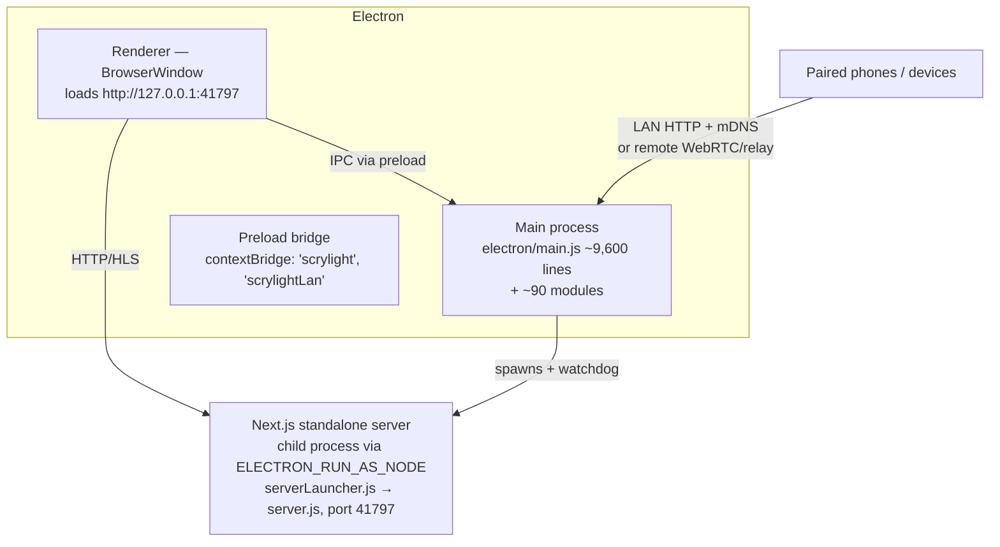
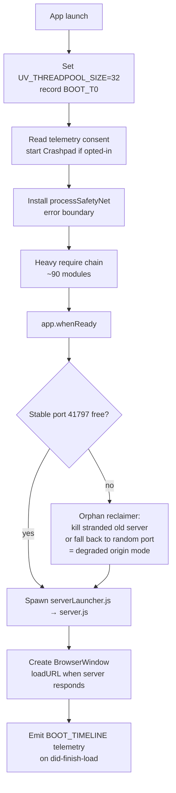
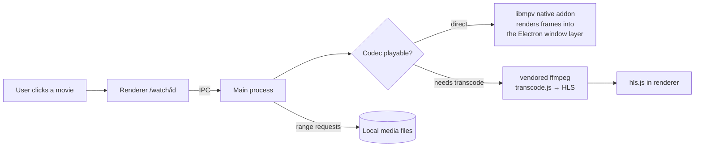
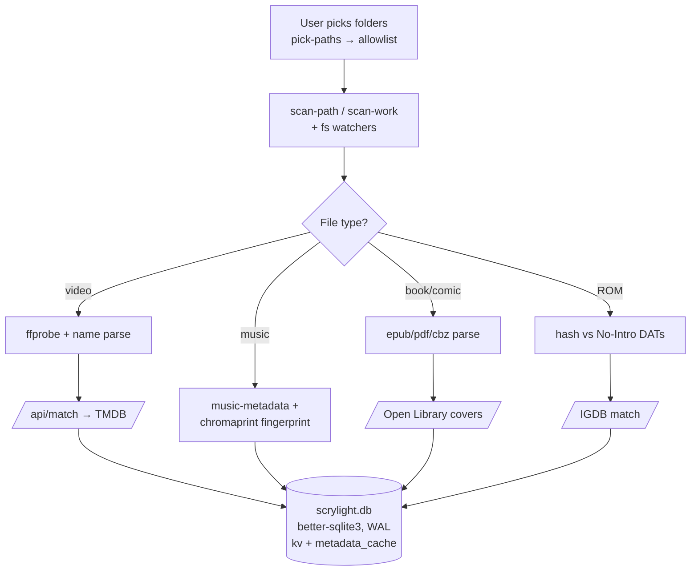
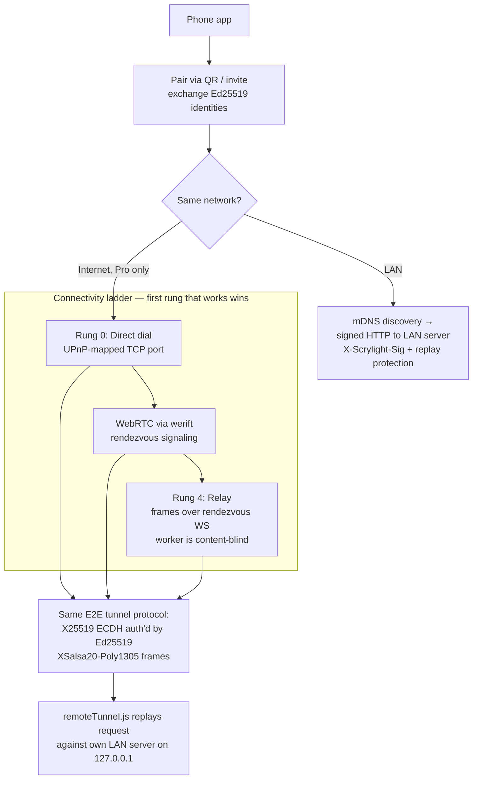
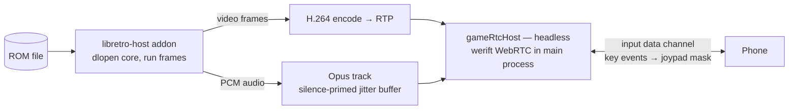
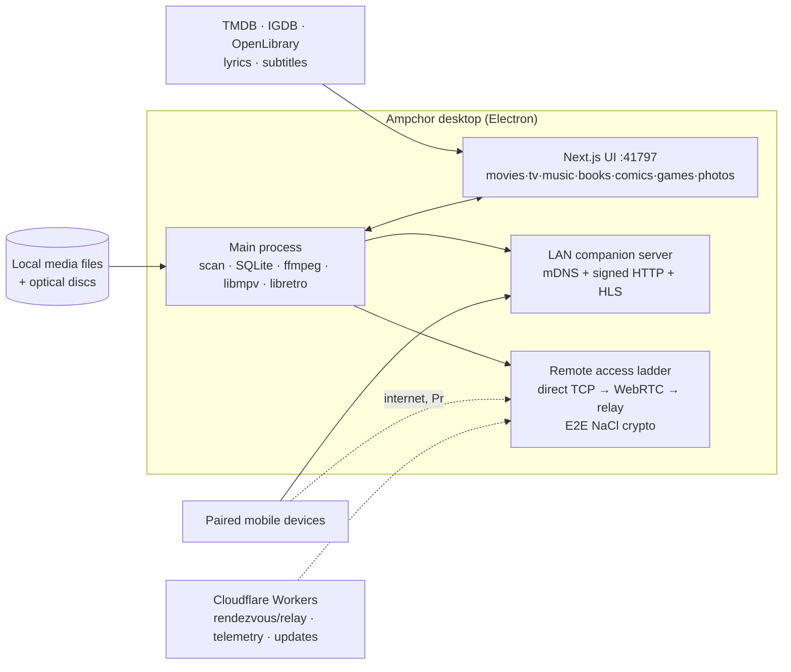

# Ampchor.app — Reverse-Engineered Architecture Breakdown

> Analysis of `Ampchor.app` v1.0.21 (bundle id `com.ampchor.app`, internal codename **"scrylight"**).
> Ampchor is a **self-hosted personal media center**: it scans local media files (movies, TV, music, audiobooks, books, comics, photos, retro-game ROMs), enriches them with public metadata, plays them locally, and streams them to paired devices over LAN or the internet.

---

## 1. High-Level Identity

| Property | Value |
|---|---|
| Product | Ampchor (codename `scrylight`) |
| Version | 1.0.21 |
| Vendor | Ampchor LLC (`ampchor.com`) |
| Category | Entertainment / self-hosted media center |
| Platform stack | **Electron 42** + **Next.js 14 (App Router, standalone output)** + React 18 + Tailwind CSS + TypeScript |
| Min macOS | 12.0 |
| Bundle size | ~553 MB |
| Auto-update | `electron-updater` (generic provider) → `https://updates.ampchor.com/desktop/` |
| Built with | electron-builder (DMG target, hardened runtime), CI on GitHub Actions macOS runner (`/Users/runner/work/scrylight/scrylight`) |

The source repo is a monorepo: `web/` (this app), `packages/core` (`@scrylight/core` shared domain logic, also referenced by a mobile app — an AsyncStorage adapter is mentioned), plus Playwright e2e/visual tests and Vitest unit tests (`.test.ts` files ship inside the asar).

---

## 2. Bundle Composition

```
Ampchor.app/Contents/
├── MacOS/Ampchor                      # Electron shell executable
├── Frameworks/
│   ├── Electron Framework.framework   # 266 MB — Chromium + Node
│   ├── Squirrel / Mantle / ReactiveObjC  # macOS auto-update plumbing
│   └── Ampchor Helper*.app            # GPU / Renderer / Plugin helpers
└── Resources/
    ├── app.asar                       # Electron main process + preload + node_modules
    ├── app.asar.unpacked/             # native .node addons (unpacked for dlopen)
    ├── standalone/                    # Next.js 14 standalone server (server.js + .next + minimal node_modules)
    ├── ffmpeg/darwin/ffmpeg           # vendored ffmpeg CLI binary
    ├── ffmpeg-libs/                   # ffmpeg shared libs (for native addons)
    ├── libmpv/darwin/                 # vendored libmpv (video playback engine)
    ├── tmdb-key.json / igdb-key.json  # bundled metadata API keys (TMDB, IGDB)
    ├── app-update.yml                 # electron-updater config
    ├── *.lproj/                       # ~60 locale folders
    └── THIRD_PARTY_LICENSES.md, LICENSES.chromium.html, …
```

### Three-process runtime model



1. **Main process** — all privileged work: filesystem scanning, SQLite, ffmpeg/mpv, disc drives, LAN server, remote access, telemetry.
2. **Next.js server** — spawned as a Node child (`ELECTRON_RUN_AS_NODE`) via `serverLauncher.js`; serves the entire UI and metadata API routes on a stable local port (**41797**, random fallback). A parent watchdog (`serverOrphan.js`) kills it if the app dies, and an orphan reclaimer recovers stranded ports on next launch.
3. **Renderer** — a `BrowserWindow` that simply loads the local Next.js URL; talks to main via ~150 IPC channels exposed by the preload script.

---

## 3. Frontend (Next.js 14 App Router)

Standalone output (`output: 'standalone'`), React 18, Tailwind, `transpilePackages: ['@scrylight/core']`.

### Page routes (media verticals)

| Vertical | Routes |
|---|---|
| Video | `/movies`, `/tv/[slug]`, `/anime`, `/watch/[id]`, `/live`, `/watchlist` |
| Music | `/music`, `/my-music`, `/artists`, `/album/[slug]`, `/songs`, `/playlists`, `/now-playing`, `/ipod` |
| Audiobooks | `/audiobooks/[id]`, `/listen/[id]` |
| Books/Comics | `/books/[id]`, `/read/[id]`, `/reading`, `/comics`, `/comic/[id]`, `/author/[name]` |
| Games | `/games/[id]`, `/play/[id]` (libretro emulation) |
| Photos | `/photos` |
| Library mgmt | `/library`, `/library-issues`, `/duplicates`, `/lists`, `/history`, `/explore`, `/search` |
| Accounts/misc | `/login`, `/signup`, `/profiles`, `/profile`, `/settings`, `/lan`, `/wishlist`, `/dev/mpv-test`, `/dev/retro-test` |

### API routes (server-side metadata enrichment)
`/api/match`, `/api/match-by-id`, `/api/search-external`, `/api/search-meta`, `/api/movie-details`, `/api/show-episodes`, `/api/show-credits`, `/api/content-rating`, `/api/tmdb-logo`, `/api/artist-image|photo|photo-bytes`, `/api/author-bio|image`, `/api/audiobook-cover`, `/api/local-cover`, `/api/lyrics-search`, `/api/subtitles`, `/api/igdb-match`, `/api/comics`, `/api/alias-titles`, `/api/image-convert`, `/api/thumbnails`.

**Metadata sources**: TMDB (movies/TV, bundled API key), IGDB (games, bundled creds), Open Library (books — `covers.openlibrary.org` in image allowlist), lyrics search. Image CSP for `next/image` restricts remote images to TMDB/OpenLibrary.

Renderer-side libraries: `hls.js` (streaming playback), `pdfjs-dist` (PDF reading, with bundled cmaps/fonts/worker in `public/`), `epubjs` (EPUB), `jszip`/`mammoth` (comics/docs), `music-metadata-browser`, `qrcode` (pairing), `dompurify`. A service worker (`public/sw.js`) and PWA manifest exist.

---

## 4. Electron Main Process (`app.asar/electron/`, ~190 files)

`main.js` is ~9,600 lines and delegates to focused modules, each with colocated Vitest tests. Notably, the code is densely commented with dated post-mortem rationale ("Audit H7", fleet telemetry findings), indicating a telemetry-driven engineering process.

### Functional clusters

**Boot & resilience**
- `processSafetyNet.js` — process-level error boundary installed before the require chain.
- Boot timeline telemetry (BOOT_T0 phases), `UV_THREADPOOL_SIZE=32` to survive stalled SMB mounts.
- `gpuSafeMode.js`, `serverOrphan.js` (port-orphan reclaim), `autoUpdate.js`, `trayHandlers.js`, `driveKeepAwake.js`.

**Data layer**
- `db.js` — **better-sqlite3** (`scrylight.db` in userData, WAL mode). Two tables: `kv` (backs `@scrylight/core`'s ScrylightStorage — progress, likes, overrides) and `metadata_cache` (offline metadata per owned item). Degrades gracefully to renderer localStorage if the native module fails to load.
- `secureStore.js`, `secureFile.js`, `secureBackend.js` — encrypted storage; `backupHandlers.js` — backup/restore incl. retro save data.
- `versionedCache.js`, `byteLru.js`, `contentHashCache.js`, `ebookCache.js`, `remoteAudioCache.js`.

**Library scanning & identification**
- `scan-path`/`scan-work` IPC, `watchHandlers.js` (fs watching), `storageVolumes.js` / `storageKind.js` (volume/mount classification), `fileHealthKinds.js`, `contentHash.js`.
- `romIdentify.js` + `native/no-intro-dats/` — ROM identification against No-Intro DAT files; `gameCoreMap.js` maps systems → libretro cores.
- `discIdentify.js`, `audioCd.js`, `dvdDisc.js`, `discWatch.js`, `audioRip.js` — optical disc detection, identification, and CD ripping.
- `parse-music-meta` (music-metadata), `aiff.js`, chromaprint/`fpcalc` fingerprinting (via ffmpeg tooling).

**Media pipeline**
- Vendored **ffmpeg** binary (`ffmpegPath.js`, `ffmpegHandlers.js`): thumbnails, scrub sprites (`scrubSprite.js`), loudness analysis, PCM extraction, preview generation, `transcode.js` (HLS transcoding for streaming), `rawPreview.js`.
- **libmpv** native addon (`native/libmpv-render`, `scrylight_mpv.node`): in-process libmpv render API drawing video directly into the Electron window layer — the local high-quality video player. 15 IPC channels in `mpvHandlers.js`.
- `streamFile.js`, `rangeRequest.js` — HTTP range serving of media.

**Retro gaming**
- `native/libretro-host` — native addon that `dlopen`s libretro cores, runs frames, and captures video/audio.
- `retroHandlers.js`, `retroLoad.js`, `extract-rom` (7zip-bin for archives).
- **Game streaming to phones**: `gameRtcHost.js` — headless WebRTC host in the main process using **werift** (pure-JS WebRTC): H.264/RTP video (`rtpSender.js`), Opus audio, input data channel mapped to the libretro joypad. `gameStreamChild.js`/`gameStreamSession.js`, `gameCongestionController.js`.

**LAN companion server (device pairing & streaming)**
- An HTTP server in the main process serving paired devices (phones): library payloads, posters, `/stream` + HLS.
- Discovery via **bonjour-service** (mDNS publish) with subnet-scan fallback.
- `lanAuth.js` (signed requests — `X-Scrylight-Sig`), `pairThrottle.js` (per-IP throttling), `pair-start`/`invite-*` IPC, QR pairing, `remoteDeviceLimits.js`, `lanCounters.js`, `lanLifecycleHandlers.js`.
- Trust model: long-term **Ed25519** device identities established at pairing.

**Remote access (paid "Pro" feature) — a 4-rung connectivity ladder**
1. **Rung 0 — Direct dial** (`directHost.js`): one standing TCP port mapped on the router via UPnP/NAT-PMP (`natPortMap.js`); internet-facing WebSocket with a deliberately tiny pre-auth surface (5s handshake deadline, 8KB cap, silent failures, throttle strikes).
2. **WebRTC** (`remoteRtcHost.js`, werift): data channel carrying a tunnel protocol; `rtcAuth.js` for auth.
3. **Rendezvous signaling** (`remoteRendezvous.js`): a Cloudflare-Worker-style rendezvous service for session brokering.
4. **Rung 4 — Relay** (`relayHost.js`): when both ends are CGNAT'd, the same rendezvous WebSocket carries E2E-encrypted frames; the relay worker stays content-blind.

- All rungs share one crypto design (`relayCrypto.js`, **tweetnacl**): ephemeral X25519 ECDH authenticated by Ed25519 pairing identities → XSalsa20-Poly1305 (NaCl box) frames, with transcript binding and domain separation between rungs.
- `remoteTunnel.js` replays tunneled requests against the local LAN server over 127.0.0.1 (reusing signature auth + nonce replay protection), with a media-priority send gate so audio/HLS outranks poster art on the single ordered data channel.
- `remoteInvite.js`/`remoteInviteStore.js` — invite create/list/revoke.

**Access control & licensing**
- `adminAuth.js` — admin PIN with recovery, lock/unlock (parental-control-style), constant-time comparisons (`constantTime.js`).
- Pro licensing IPC: `pro-activate/deactivate/renew/status/key/portal` — key-based activation with a customer portal.
- Path allowlisting (`add-allowed-paths`/`set-allowed-paths`) and `fileAccessHandlers.js` gate what the renderer may read.
- Custom `scrylight://` protocol (`scrylightProtocol.js`, `scrylightUrl.js`).

**Telemetry & diagnostics (self-hosted, replaced Sentry)**
- Explicit opt-in consent model; `telemetryPref/State/Snapshot.js` send counters-and-ids-only snapshots to a Cloudflare Worker endpoint; Electron **crashReporter** (Crashpad) posts crash dumps to the same worker.
- `diagnostics.js` (event journal), `debugLog.js`, `runtimeCounters.js`, `sessionHealth.js`, `appActivity.js`, `report-trouble`/`send-diagnostic-report`/`send-feature-request` IPC, `hardwareInfo.js`, `self-check`.

### Preload / IPC surface
`preload.js` (~770 lines) exposes two frozen APIs via `contextBridge`:
- **`window.scrylight`** — ~140 methods (db*, ffmpeg*, backup*, admin*, archive*, disc, retro, pro, telemetry, pairing…).
- **`window.scrylightLan`** — LAN-companion-specific surface.

---

## 5. Native & Vendored Components

| Component | Kind | Purpose |
|---|---|---|
| `scrylight_mpv.node` (libmpv-render) | N-API addon | In-process libmpv client+render API → video frames into the BrowserWindow layer |
| libretro-host addon | N-API addon | dlopen libretro cores; run frames; capture video/audio; joypad input |
| `better-sqlite3` | N-API addon | Synchronous SQLite data layer |
| ffmpeg (vendored binary + shared libs) | CLI + dylibs | Transcoding, HLS, thumbnails, loudness, fingerprinting |
| libmpv (vendored dylib) | dylib | Playback engine backing the mpv addon |
| werift (+ werift-dtls/ice/rtp/sctp) | pure-JS | WebRTC without Chromium in the main process |
| tweetnacl | pure-JS | Ed25519 identities, X25519/XSalsa20-Poly1305 E2E crypto |
| 7zip-bin | binary | Archive/ROM extraction |
| bonjour-service | pure-JS | mDNS/Bonjour LAN discovery |

All `.node` addons are `asarUnpack`ed. Native modules are built against the Electron ABI via `electron-rebuild` with vendored MPV/ffmpeg lib paths.

---

## 6. Security Posture (observed)

- Context isolation with a frozen, curated preload API (no raw `ipcRenderer` exposure).
- Path allowlist gating renderer file access; admin PIN with constant-time checks.
- E2E encryption for all remote transports; relay/rendezvous servers are content-blind; signature-authenticated LAN requests with nonce/replay protection.
- Internet-facing direct-dial socket hardened: pre-auth caps, silent failure (no error oracle), per-IP throttling.
- ATS exceptions only for `localhost`/`127.0.0.1` HTTP (the local Next server); `NSAllowsArbitraryLoads` is enabled, though.
- Asar integrity hash enforced (`ElectronAsarIntegrity`), hardened runtime; app is **not identity-signed** in this build config (`identity: null` — ad-hoc/dev-style DMG).
- Caveats: TMDB/IGDB API keys ship in plaintext in `Resources/`; telemetry ingest token is embedded in the client (acknowledged in comments as a query-token gate).

---

## 7. Notable Engineering Patterns

- **Monorepo + shared core**: `@scrylight/core` shared with a mobile client (the "paired phone" side).
- **Fleet-telemetry-driven development**: boot phases, orphan reclaim, threadpool sizing all justified in comments by fleet metrics and dated incidents.
- **Graceful degradation everywhere**: SQLite → localStorage fallback; mDNS → subnet scan; stable port → random port "degraded origin" mode; connectivity ladder direct → WebRTC → relay.
- **Tests ship in-bundle**: ~90 `.test.ts` files sit next to their modules inside app.asar (unstripped).
- **One tunnel protocol, many transports**: the same encrypted `ping/req/abort` framing runs over WebRTC data channels, direct TCP WebSocket, and relayed WebSocket.

---

## 8. Flow Charts

### 8.1 Boot sequence



### 8.2 Local playback path



### 8.3 Library scan & metadata enrichment



### 8.4 Device pairing & remote connectivity ladder



### 8.5 Game streaming (retro emulation to phone)



---

## 9. Summary Diagram


