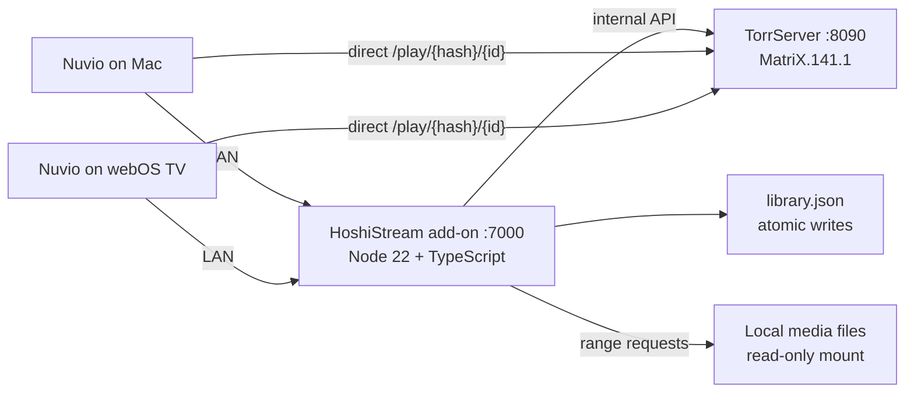

# Architecture Overview

HoshiStream is a private, local-first Stremio-compatible add-on for Nuvio. A small Node.js 22 + TypeScript server keeps a personal JSON library, asks TorrServer to inspect authorized torrents, and hands Nuvio direct playback URLs. The add-on never proxies torrent video bytes and performs no transcoding.

## System diagram

Torrent-backed streams are served directly by TorrServer; the add-on rewrites TorrServer's internal URL to the public LAN URL (`streams.ts#rewritePublicUrl`). Local-file entries are streamed by the add-on itself with HTTP range support via `/local/{token}/{entryId}/{fileId}`.

## Module map (`addon/src`)

| Module | Responsibility |
|---|---|
| `index.ts` | Process entry point; wires config, library, TorrServer client, HTTP server |
| `config.ts`, `config-schema.ts` | Zod-validated environment configuration |
| `routes.ts` | Single HTTP handler: health, addon protocol, management API, local media |
| `manifest.ts` | Stremio manifest (`com.john.private-torrent-streamer`, catalogs, `hoshi:` prefix) |
| `addon.ts`, `catalog.ts`, `metadata.ts`, `streams.ts` | Stremio catalog/meta/stream resources |
| `library.ts` | Atomic JSON library CRUD (`library.json`) |
| `types.ts` | Zod schemas for library entries (create/patch) |
| `torrserver-client.ts` | Verified TorrServer API subset with timeouts and Zod parsing |
| `inspection.ts` | Torrent registration + metadata polling + file selection |
| `media-file-selection.ts` | Playable-extension filtering, series episode mapping (`S01E02`, `1x02`) |
| `media-probe.ts` | ffprobe-based resolution/codec/bitrate probe with speed verdict |
| `local-media.ts` | Local file/folder validation, managed uploads, range-request serving |
| `native-picker.ts` | Native Finder picker bridge over the supervisor Unix socket |
| `management.ts` | Embedded single-page management UI (HTML) |
| `security.ts` | Constant-time token comparison (SHA-256 digest + `timingSafeEqual`), bearer parsing |

## Data flow: playing a torrent entry

1. Nuvio requests `/addon/{token}/stream/{type}/{id}.json`.
2. `streams.ts` loads the entry, `inspection.ts` registers the magnet/torrent with TorrServer (`save_to_db: false`) and polls `waitForFiles` (up to 30 s).
3. `media-file-selection.ts` picks the playable file (or maps season/episode for series; `preferredFileIndex` and `fileOverrides` take precedence).
4. The internal `/play/{hash}/{id}` URL is rewritten to `PUBLIC_TORRSERVER_URL` and returned with `behaviorHints` (filename, videoSize, bingeGroup).
5. Nuvio streams directly from TorrServer; the add-on is not in the media path.

## Deployment modes

### Docker Compose (`docker-compose.yml`)
- `torrserver`: pinned `ghcr.io/yourok/torrserver:MatriX.141.1`, 1.3 GiB mem limit, healthchecked.
- `addon`: built from `addon/Dockerfile`, 200 MiB mem limit, waits for TorrServer health.
- Log rotation: 3 × 10 MiB per service.

### Native macOS menu-bar app
- Swift supervisor (`supervisor/macos`) bundles Node and TorrServer runtimes (`packaging/` lockfiles) and supervises both processes without Docker.
- Provides native Finder pickers over a Unix socket (`NATIVE_PICKER_SOCKET`).
- See `../plans/desktop-app-strategy.md` for the full strategy.

## State layout

| Location | Contents |
|---|---|
| `data/library.json` (Compose) | The library, a JSON array written atomically |
| `data/media/` | Browser-uploaded managed media (`UPLOAD_ROOT`) |
| `torrserver/config/settings.json` | Cache size, connection, and cleanup settings |
| `torrserver/torrents/` | TorrServer disk cache (bounded, 2 GiB per active torrent) |
| `~/Library/Application Support/HoshiStream` | Native app mutable state |
| `~/Library/Logs/HoshiStream/server.log` | Native app logs |

## Explicit non-goals

No torrent search or index scraping, no transcoding, no database, no graphical dashboard beyond the token-gated management page, no telemetry, no public exposure.
