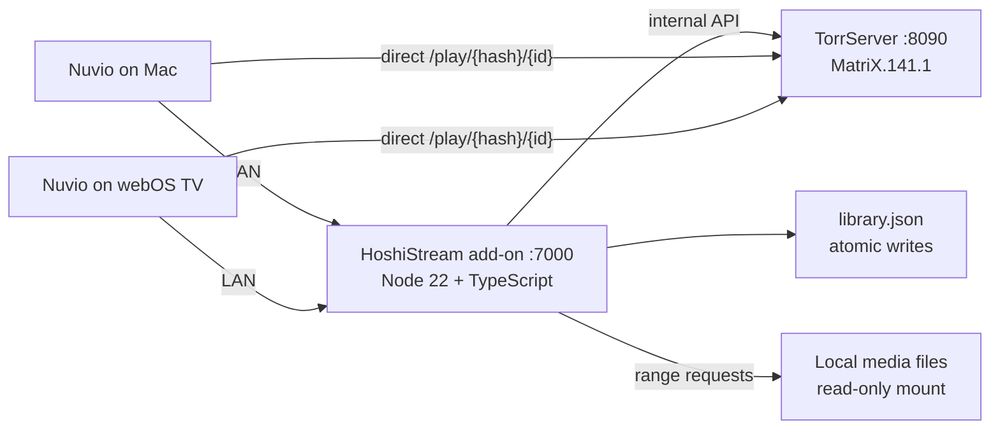

# Architecture Overview

HoshiStream is a private, local-first Stremio-compatible add-on for Nuvio. A small Node.js 22 + TypeScript server keeps a personal JSON library, asks TorrServer to inspect authorized torrents, and hands Nuvio direct playback URLs. The add-on never proxies torrent video bytes and performs no transcoding.

## System diagram

Torrent-backed streams are served directly by TorrServer; the add-on rewrites TorrServer's internal URL to the public LAN URL (`streams.ts#rewritePublicUrl`). Local-file entries are streamed by the add-on itself with HTTP range support via `/local/{token}/{entryId}/{fileId}`.

## Module map (`addon/src`)

| Module | Responsibility |
|---|---|
| `index.ts` | Process entry point; wires config, library, TorrServer client, HTTP server |
| `config.ts`, `config-schema.ts` | Zod-validated environment configuration |
| `routes.ts` | HTTP dispatcher: builds the handler context from `HandlerOptions`, walks the open and `/api/*` route lists, maps errors via `routes/errors.ts` |
| `routes/context.ts` | `HandlerContext`, `RouteHandler` contract, and JSON/HTML reply helpers shared by route modules |
| `routes/protocol.ts` | Health, readiness, static assets, management page, tokenized Stremio manifest/catalog/meta/stream |
| `routes/media.ts` | `/hls`, `/local`, and `/media` playback routes |
| `routes/library-api.ts` | `/api/library*` CRUD, inspect, relink, uploads, native picker grants, Stremio refresh |
| `routes/disk-api.ts` | `/api/volumes`, disk-copy enable/retry, disk jobs, disk schedule |
| `routes/system-api.ts` | Status, resources, speed test, player, clients, pointer, analysis, transcode sessions |
| `manifest.ts` | Stremio manifest (`com.john.private-torrent-streamer`, catalogs, `hoshi:` prefix) |
| `addon.ts`, `catalog.ts`, `metadata.ts`, `streams.ts` | Stremio catalog/meta/stream resources |
| `library.ts` | Atomic JSON library CRUD (`library.json`) |
| `types.ts` | Zod schemas for library entries (create/patch) |
| `torrserver-client.ts` | Verified TorrServer API subset with timeouts and Zod parsing |
| `inspection.ts` | Torrent registration + metadata polling + file selection |
| `media-file-selection.ts` | Playable-extension filtering, series episode mapping (`S01E02`, `1x02`) |
| `media-probe.ts` | ffprobe-based resolution/codec/bitrate probe with speed verdict |
| `speedtest.ts` | Measured link speed via Cloudflare's open speed-test endpoint; startup + on-demand runs |
| `resources.ts` | Process CPU/RSS grouping (`ps`) and cache-directory sizes for the status page |
| `transcode.ts` | Opt-in stream repair (ADR 0010): ffmpeg HLS sessions for remux, audio fix, and hardware video re-encode |
| `mdns.ts` | LAN discovery (ADR 0011): dependency-free mDNS responder advertising `_hoshistream._tcp` |
| `local-media.ts` | Local file/folder validation, managed uploads, range-request serving |
| `native-picker.ts` | Native Finder picker bridge over the supervisor Unix socket |
| `management.ts` | Thin HTML shell for the management UI; views live in `assets/manage/` as preact components (no build step) |
| `security.ts` | Constant-time token comparison (SHA-256 digest + `timingSafeEqual`), bearer parsing |

## Data flow: playing a torrent entry

1. Nuvio requests `/addon/{token}/stream/{type}/{id}.json`.
2. `streams.ts` loads the entry, `inspection.ts` registers the magnet/torrent with TorrServer (`save_to_db: false`) and polls `waitForFiles` (up to 30 s).
3. `media-file-selection.ts` picks the playable file (or maps season/episode for series; `preferredFileIndex` and `fileOverrides` take precedence).
4. The internal `/play/{hash}/{id}` URL is rewritten to `PUBLIC_TORRSERVER_URL` and returned with `behaviorHints` (filename, videoSize, bingeGroup).
5. Nuvio streams directly from TorrServer; the add-on is not in the media path.

## Deployment

One mode: the native app. Containers were removed in 0.7.0 ([ADR 0009](../decisions/0009-native-only-deployment.md)).

Two processes are always supervised together:

- **TorrServer** — the BitTorrent engine, pinned to MatriX.141.1 and started from a vendored binary.
- **The Node add-on** — library, management UI, add-on protocol, local file serving, and host playback.

- Supervision lives in `scripts/native-server.mjs`, which is plain cross-platform Node: ports, environment, state directories, TorrServer config, and process lifecycle.
- The macOS shell is the Swift supervisor (`supervisor/macos`): menu bar, login item, sleep assertion, native Finder pickers over a Unix socket (`NATIVE_PICKER_SOCKET`), and log access.
- Runtimes are vendored and pinned via `packaging/` lockfiles, which carry `darwin-arm64` and `win32-x64` entries.
- See `../plans/desktop-app-strategy.md` for the app strategy and `../plans/2026-08-14-native-only-plan.md` for the Windows path.

## State layout

| Location | Contents |
|---|---|
| `<state dir>/library.json` | The library, a JSON array written atomically |
| `<state dir>/media/` | Browser-uploaded managed media (`UPLOAD_ROOT`) |
| `<state dir>/torrserver/config/settings.json` | Cache size, connection, and cleanup settings |
| `<state dir>/torrserver/torrents/` | TorrServer disk cache |
| `<state dir>/transcode/` | Stream-repair HLS sessions (swept at startup) |
| `~/Library/Logs/HoshiStream/server.log` | Server logs (macOS) |

`<state dir>` is `~/Library/Application Support/HoshiStream` on macOS and
`%LOCALAPPDATA%\HoshiStream` on Windows, overridable with `HOSHISTREAM_STATE_DIR`.
| `~/Library/Logs/HoshiStream/server.log` | Native app logs |

## Explicit non-goals

No torrent search or index scraping, no database, no graphical dashboard beyond the token-gated management page, no telemetry, no public exposure. Transcoding is opt-in repair only ([ADR 0010](../decisions/0010-opt-in-realtime-transcoding.md)): nothing is re-encoded when direct play works, there is no background/batch transcoding, and video is only ever encoded in hardware.
