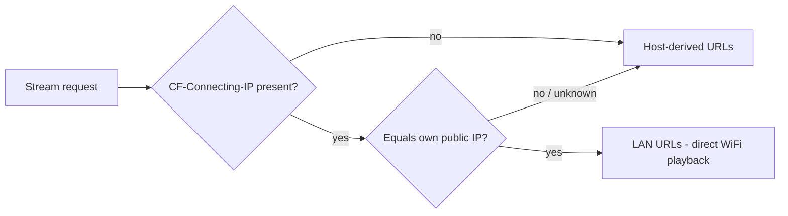

# Remote Access with Cloudflare Tunnel

Expose HoshiStream securely outside your home without opening router ports. A Cloudflare Tunnel makes an outbound connection from your machine to Cloudflare; clients reach the add-on through a hostname on your domain. HoshiStream detects when a tunnel client is actually inside your house and hands it LAN stream URLs so video never hairpins through Cloudflare.

## Prerequisites

- A Cloudflare account (free plan works) with a domain added to it.
- The Docker stack running, or the native macOS app.

## 1. Create the tunnel

1. Cloudflare dashboard → **Zero Trust → Networks → Tunnels → Create a tunnel** (Cloudflared connector).
2. Name it (e.g. `hoshistream`) and copy the **tunnel token**.
3. Under **Public Hostname**, add e.g. `hoshi.your-domain.com` pointing at:
   - Docker: `http://addon:7000`
   - Native app: `http://localhost:7001`

## 2. Run the connector

### Docker mode

Add the token to `.env`:

```
TUNNEL_TOKEN=eyJh...
```

Start the stack with the tunnel profile:

```bash
docker-compose --profile tunnel up -d
```

Without `--profile tunnel` the connector is simply not started — the base stack is unchanged.

### Native macOS mode

```bash
brew install cloudflared
sudo cloudflared service install eyJh...   # the tunnel token
```

`cloudflared` runs as a LaunchDaemon and reconnects automatically.

## 3. Use the tunnel manifest URL

Install the add-on in Stremio/Nuvio with the tunnel hostname:

```
https://hoshi.your-domain.com/addon/<ACCESS_TOKEN>/manifest.json
```

The path token still gates everything; the tunnel adds TLS for free.

## How LAN detection works

Requests through the tunnel carry a `CF-Connecting-IP` header with the client's real public IP (set by Cloudflare — it cannot be forged from outside). When a stream is requested, HoshiStream compares that IP with its own public IP (a cached lookup of `cloudflare.com/cdn-cgi/trace`, refreshed every 5 minutes):

- **Match** → the client shares your internet connection, so the stream URLs use your configured LAN addresses (`PUBLIC_ADDON_URL` / `PUBLIC_TORRSERVER_URL`, or the auto-detected LAN IP in native mode). Video flows directly over WiFi.
- **No match, missing header, or lookup failure** → stream URLs keep the tunnel hostname. Playback always works; the LAN shortcut is purely an optimization.



Only the small JSON control-plane responses ever touch Cloudflare for at-home clients; the video bytes stay on your network.

## Caveats

- **CGNAT**: if your ISP puts multiple households behind one public IP, unrelated clients could be mistaken for at-home ones and receive unreachable LAN URLs. Set `LAN_REDIRECT=off` in `.env` to always use tunnel URLs.
- **Upload bandwidth**: remote playback is capped by your home connection's upload speed.
- **Free-plan terms**: Cloudflare's free tier is not intended for heavy sustained video proxying; personal remote viewing is generally fine, but the LAN detection keeps at-home traffic off Cloudflare entirely.
- **Mixed content**: the manifest is `https://` while LAN stream URLs are `http://` — Stremio and Nuvio native players handle this fine.
