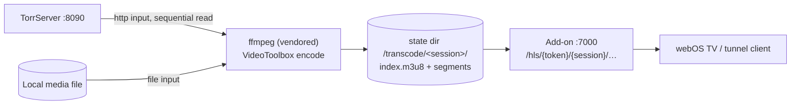

# Real-time transcoding plan (opt-in stream repair)

Date: 2026-08-23
Status: draft — pending ADR 0010 acceptance
Depends on: [ADR 0010](../decisions/0010-opt-in-realtime-transcoding.md)

## Goal

Make known-unplayable media (bad container, DTS/TrueHD audio, undecodable codec) play on
webOS TVs and low-bandwidth tunnel clients, without touching the direct-play path that
works today. Default OFF; enabled per config flag `TRANSCODE_ENABLED`.

## Pipeline

- Torrent input: TorrServer's `127.0.0.1` play URL (piece priority follows ffmpeg reads).
- Local input: the file path directly.
- Output: HLS, fMP4 segments (required for HEVC), 6-second target duration, playlist
  grows as segments land; playback starts after ~2–3 segments.

## Repair tier selection

Extend the probe verdict (`media-probe.ts`) into a per-client-class decision:

| Condition (probe result) | Tier | ffmpeg args (core) |
|---|---|---|
| Everything compatible | none — direct play | — |
| Container-only problem (MKV, playable codecs) | R remux | `-c copy -f hls` |
| DTS / TrueHD / >6ch audio | A audio fix | `-c:v copy -c:a ac3` (or aac) |
| AV1 / HEVC profile unplayable, or user-selected bitrate cap | V video | `-c:v h264_videotoolbox -b:v <target>` + tier A audio |

`fileOverrides`/entry-level `forceTranscode` lets the user override the verdict.

## Session model

- `TranscodeSession`: id (random token), entryId, fileId, tier, ffmpeg PID, created,
  lastSegmentRequest.
- One session per (entry, file, tier); a second identical request joins the existing
  session.
- Idle reaper: no segment request for 60 s → SIGTERM ffmpeg, delete directory.
- Startup sweep: delete all of `<state dir>/transcode/` on boot.
- Cap: `TRANSCODE_MAX_SESSIONS` (default 2) — reject further stream requests with the
  direct-play URL and a warning.
- Disk guard: rolling window — delete segments more than N minutes behind the newest
  requested segment (default keeps full session; window mode is a stretch goal).

## Seeking

HLS playlist is served as VOD-with-growing-window (`EXT-X-PLAYLIST-TYPE:EVENT`). Seeks
inside already-produced segments are free. Seeks beyond the encode head restart ffmpeg
with `-ss <t>` in a **new session directory**, keyed by (entry, file, tier, startOffset).
Old session reaped by the idle timer. Accepted cost: a few seconds per far seek.

## Stream response integration

In `streams.ts`, when a repair tier is chosen the stream object's URL becomes
`{publicAddonUrl}/hls/{token}/{session}/index.m3u8` instead of the TorrServer play URL.
Both can be offered as separate stream entries ("Direct" / "Compatible"), letting the
user pick in the Stremio UI — cheapest possible UX for overrides.

## Work phases

### Phase 1 — Vendor ffmpeg + tier R/A (remux & audio fix) — DONE 2026-08-23
1. ~~Vendor ffmpeg~~ — `packaging/ffmpeg-lock.json` + `fetch-ffmpeg.mjs`
   (darwin-arm64: Martin Riedl 9.0.1 release zips incl. ffprobe; win32-x64:
   BtbN n8.1.2 pinned autobuild), checksum-verified like TorrServer.
   `native-server.mjs` prefers the vendored binary and falls back to PATH.
2. ~~`transcode.ts`~~ — `TranscodeManager` (session registry keyed by
   entry+file, injectable spawn for tests, idle reaper, startup sweep,
   session cap), pure `repairTier`/`ffmpegArgs` helpers.
3. ~~Routes~~ — `/hls/{token}/{entryId}/{fileId}/{asset}` with a strict asset
   allowlist (`index.m3u8`, `init.mp4`, `seg-N.m4s`); sessions start lazily on
   the first playlist request, so listing streams never spawns ffmpeg.
4. ~~`streams.ts`~~ — "Compatible" second stream when the probe verdict
   warrants a repair and `TRANSCODE_ENABLED` is on.
5. ~~Config~~ — `TRANSCODE_ENABLED` (default false), `TRANSCODE_MAX_SESSIONS`
   (default 2), `TRANSCODE_DIR`, `FFMPEG_PATH`; documented in `.env.example`.
6. ~~Tests~~ — 15 transcode tests (tier selection, args, lifecycle, cap,
   allowlist, reaper) plus config coverage; verified end-to-end with a real
   ffmpeg remux of an MKV through the HLS route.

### Phase 2 — Tier V (video transcode)
1. VideoToolbox availability check at startup (`ffmpeg -encoders` parse, cached).
2. h264_videotoolbox encode path with bitrate presets (e.g. 4/8/12 Mbps).
3. Tunnel-client bitrate cap: reuse ADR 0007 LAN detection — offer capped rendition to
   non-LAN clients.
4. On-TV validation matrix: MKV/H264+DTS, HEVC 10-bit, AV1 samples on the actual webOS
   target; record results in this doc.

### Phase 3 — Seek restart + polish
1. `-ss` restart sessions keyed by offset; playlist stitching kept simple (new session
   per far seek).
2. Idle reaper tuning, disk usage logging (structured, no URLs/tokens).
3. Management UI: per-entry transcode status + kill button.
4. Changelog + architecture-overview update; flip docs from draft.

## Non-goals (unchanged)

- No software (CPU) video encoding fallback.
- No adaptive bitrate ladder, no multi-rendition simultaneous encode.
- No background/batch pre-transcoding of the library.
- No torrent logic in the add-on; TorrServer remains the only BitTorrent engine.

## Open questions

1. AC3 vs AAC default for tier A — AC3 passes through LG ARC/eARC better; AAC is safer
   in-TV. Proposal: AC3 default, config override.
2. Windows: VideoToolbox is macOS-only; Windows needs a Media Foundation
   (`h264_mf`) or NVENC/QSV probe. Defer tier V on Windows until the launcher ships?
3. Should the "Compatible" stream appear even when direct play is predicted to work
   (user choice), or only on predicted failure? Proposal: only on predicted failure +
   per-entry override, to keep the stream list clean.
