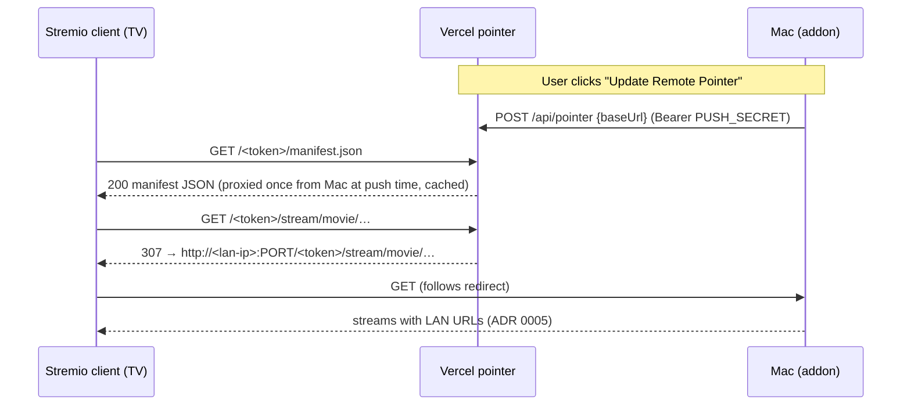

# 2026-09-01 — Stable manifest URL via Vercel pointer server

## Problem

The addon manifest URL installed in Stremio/Nuvio embeds the Mac's LAN IP.
Every DHCP renewal or network move invalidates the saved URL and forces the
user to re-enter it on every client device. ADR 0005 fixed stream URLs going
stale; ADR 0011 fixed *finding* the box; neither fixes the stored manifest
URL itself.

## Decision summary (agreed in chat)

- Deploy a tiny **pointer server on Vercel** at a permanent hostname. Clients
  install `https://<pointer-host>/<token>/manifest.json` once and never again.
- The pointer server is a **stateless redirector**: it stores only
  `token → { baseUrl, updatedAt }` and answers addon requests with a `307`
  redirect to the Mac's current LAN base URL. It hosts no library data and no
  media. (Catalog hosting/sharing is explicitly deferred to a future phase.)
- **No automatic phone-home.** The pointer record is updated only when the
  user clicks a new menu-bar item ("Update Remote Pointer") in the macOS
  supervisor. Consistent with the spirit of ADR 0011's rejection of an
  automatic rendezvous service.
- The Mac remains the only place media and library data live; playback stays
  direct-play on the LAN (ADR 0005 Host-header logic makes redirected
  requests return correct LAN stream URLs automatically).

## Architecture

### Why manifest is served, not redirected

Some clients persist the post-redirect URL for the manifest, which would
reintroduce the stale-IP problem. The pointer server therefore serves
`manifest.json` bytes directly (a copy pushed by the Mac at button-press
time, stored alongside the pointer record). All other resources
(`/catalog/`, `/meta/`, `/stream/`, `/poster/`, etc.) are `307` redirects —
clients follow those per-request and do not persist them.

### Storage

**Vercel Blob** (single small JSON object: pointer record + manifest copy).
One record, updated only on button press, read on every request with a short
in-function cache. Alternatives: Edge Config (writes need Vercel REST API
token — more moving parts), Upstash KV (extra account). Blob is the fewest
moving parts on a hobby account.

### Security

- **Push auth**: `POST /api/pointer` requires a `PUSH_SECRET` bearer token
  (Vercel env var; also in the Mac's `.env`). Never logged.
- **Read auth**: addon paths already require the access token in the path;
  the pointer server checks it matches the token recorded at push time
  before redirecting, so the Vercel URL leaks nothing without the token.
- The pointer record contains a LAN IP — harmless off-LAN, but the endpoint
  never *returns* it except as a redirect to a valid-token request.
- Server logs: Vercel logs request paths by default; acceptable per user
  decision (trade-off acknowledged in chat).

## Failure modes

- IP changed, button not pressed → redirects point at a dead IP; playback
  fails until one click on the Mac. Menu item shows a warning state when the
  current LAN IP differs from the last-pushed one (checked on menu open —
  local comparison only, no network call).
- Vercel/Internet down → pointer URL dead, but the LAN URL
  (`http://<ip>:PORT/...` or `hoshistream.local`) still works as before;
  nothing regresses.

## Work plan

### Phase 1 — Pointer server (`pointer/` folder in this repo)

New top-level folder `pointer/` with its own `package.json` (it is deployed
to Vercel, not part of the addon runtime; the two-dependency rule of the
addon does not apply, but keep it lean: `@vercel/blob` only).

- `pointer/api/pointer.ts` — `POST` update endpoint (Zod-validated body:
  `baseUrl`, `token`, `manifest`), bearer-auth against `PUSH_SECRET`.
- `pointer/api/[...path].ts` — catch-all: serve stored manifest for
  `/<token>/manifest.json`, `307` redirect for other `/<token>/…` paths,
  `404` otherwise. Constant-time token compare.
- `pointer/vercel.json` — routes + function config.
- Unit tests for path parsing / token check (Vitest, mirroring addon style).
- Guide: `hoshistream_docs/guides/pointer-server-vercel.md` (create project,
  set `PUSH_SECRET`, link Blob store, deploy).

### Phase 2 — Addon: push endpoint

The Swift supervisor stays thin; the addon does the actual push (it owns the
token, manifest, and LAN IP detection already).

- Config (`config-schema.ts`): optional `POINTER_URL`, `POINTER_PUSH_SECRET`.
- New management route `POST /manage/<token>/pointer/push` (routes.ts):
  builds `{ baseUrl: http://<current-lan-ip>:<port>, token, manifest }`,
  POSTs to `POINTER_URL/api/pointer`, returns result + last-push state.
- `GET …/pointer/status`: last pushed IP vs current IP (for the menu warning
  state and the management UI).
- Structured logs: event names only — never the secret, token, or full URL
  with token.
- Tests in `addon/tests/`.

### Phase 3 — macOS menu-bar button

- `HoshiStreamApp.swift`: add "Update Remote Pointer" item (hidden when
  `POINTER_URL` unset), calling the management push endpoint; title/state
  reflects `pointer/status` (e.g. "Update Remote Pointer ⚠︎" when stale).
- "Copy Stremio URL" copies the pointer URL when configured, LAN URL
  otherwise.

### Phase 4 — Docs

- ADR `0012-vercel-pointer-server.md` (supersedes nothing; complements 0011,
  documents the deliberate trade-off vs. its rendezvous rejection: manual
  trigger, self-controlled server, redirect-only).
- Update `index.md`, troubleshooting guide, changelog entry on release.

## Out of scope (future phases, per user)

- Hosting the library/catalog on the pointer server.
- Sharing the catalog with other people (download info only, no streaming).
- Remote (off-LAN) playback via tunnel — existing Cloudflare guide already
  covers this independently.
