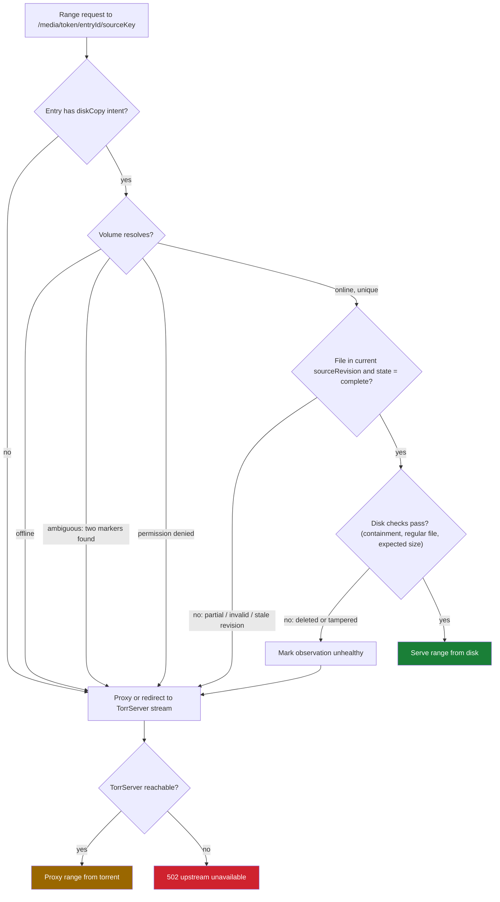
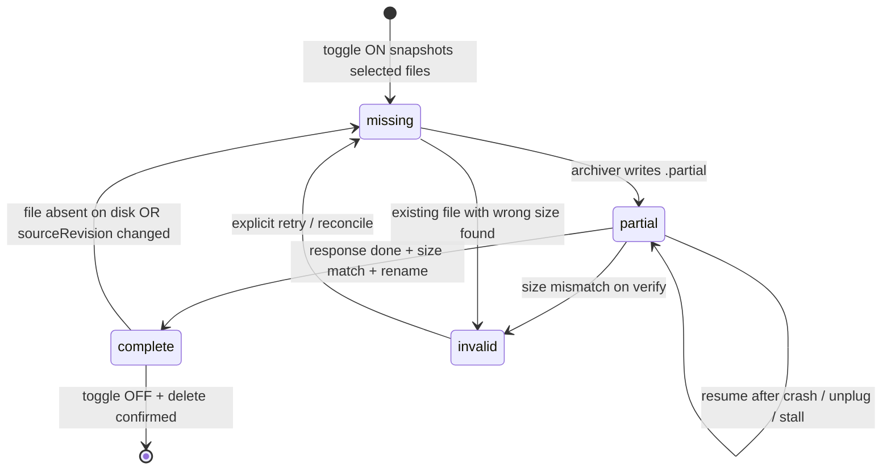
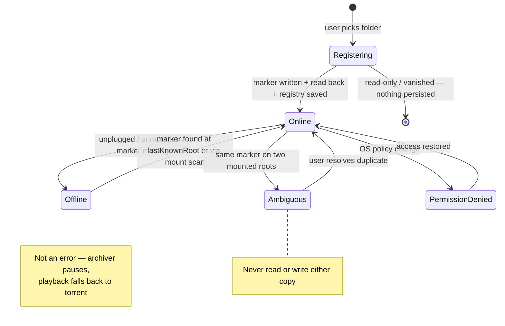
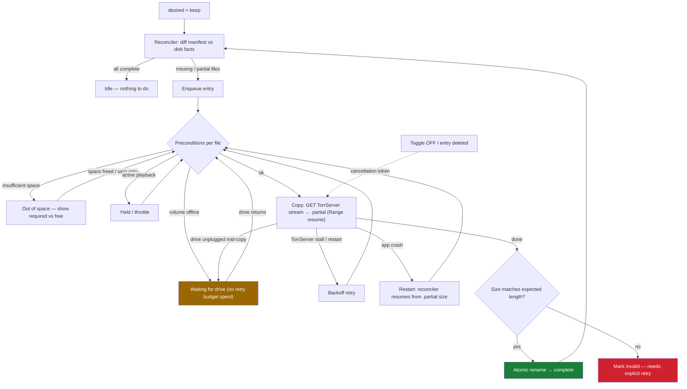
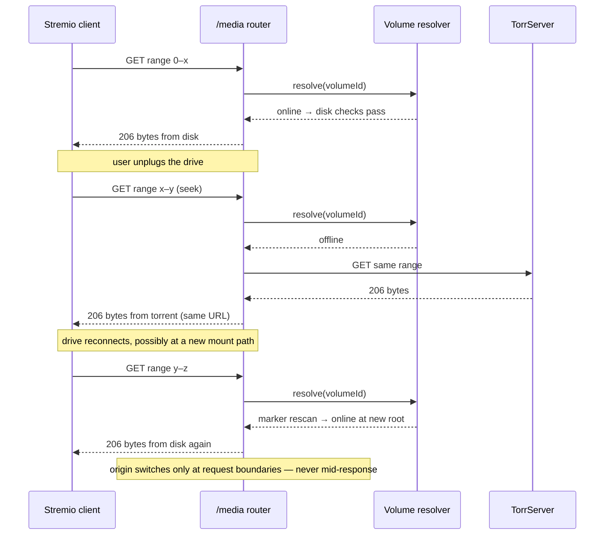

# Disk Library Plan — Save-to-Disk Toggle with External-Drive Fallback

**Date:** 2026-09-02
**Status:** Implemented (phases 1–5) — see [changelog/0.11.0-disk-library.md](../changelog/0.11.0-disk-library.md)

## Goal

Let a per-entry toggle store the movie/series files an entry streams onto a
chosen disk — including external drives. When the drive is connected and
mapped, playback streams from disk; when it is disconnected, playback falls
back to the torrent via TorrServer. The torrent source is never removed: a
disk copy is additive, not a migration.

## Design Principles

- **Additive source, not a replacement.** `magnetUri`/`torrentFilePath` stays
  on the entry. The disk copy is a cache with a stable identity, so fallback
  is always possible.
- **Reuse verified surfaces only.** Files are archived by reading TorrServer's
  existing stream URL (the same endpoint playback uses, verified against
  MatriX.141) and writing to disk with Node built-ins. No new TorrServer API
  calls, no new dependencies.
- **Volumes are identities, not paths.** External drives mount at unstable
  paths (`/Volumes/<Name>` on macOS, drive letters on Windows). The app
  identifies a volume by a marker file it writes at registration, then
  re-resolves the mount path at runtime.
- **One stable playback URL.** A source router chooses disk or torrent for
  every HTTP range request. A stream URL selected before a drive disconnects
  must not permanently pin playback to that drive.
- **Intent, durable state, and live state are separate.** "Keep on disk" is
  user intent; copy completeness is persisted metadata; volume presence and
  transfer progress are runtime observations. They must not be represented
  by one overloaded status.
- **Local-first and private.** Everything stays on the user's machine and
  drives. Structured logs never include tokens or magnet URIs.

## Architecture Overview

```
                         ┌──────────────────────────────┐
                         │        Management UI          │
                         │  volume list · entry toggle   │
                         │  archive progress · badges    │
                         └──────────────┬───────────────┘
                                        │ bearer API
┌───────────────┐   register/resolve   ┌▼──────────────────────────┐
│ Volume        │◄─────────────────────┤ Management API (routes)    │
│ Registry +    │                      │ /volumes, /entries/:id/    │
│ Watcher       │                      │ disk-copy, /disk-jobs      │
│ (marker files,│                      └┬──────────────┬────────────┘
│  mount scan)  │                       │              │
└──────┬────────┘        enqueue/cancel │              │ toggle
       │ online/offline                 ▼              ▼
       │                        ┌──────────────┐  ┌──────────────┐
       │                        │  Archiver    │  │  Library      │
       │                        │  (job queue) │  │  entry.diskCopy│
       │                        └──────┬───────┘  └──────┬───────┘
       │                               │ GET stream URL  │
       │                               ▼                 │
       │                        ┌──────────────┐         │
       │                        │  TorrServer  │         │
       │                        └──────────────┘         │
       │                                                 │
       ▼                 stream resolution               ▼
┌─────────────────────────────────────────────────────────────────┐
│ /media source router, evaluated for every HTTP range request:     │
│   valid disk file + volume online → serve local bytes             │
│   otherwise                       → proxy TorrServer bytes         │
└─────────────────────────────────────────────────────────────────┘
```

## Components

### 1. Volume Registry (`volumes.ts`, new)

A small persisted registry (JSON next to the library file) of storage
locations the user has approved:

```ts
interface StorageVolume {
  id: string;            // uuid, assigned at registration
  label: string;         // user-facing name ("Seagate 4TB")
  markerPath: string;    // "<root>/.hoshistream-volume.json"
  lastKnownRoot: string; // e.g. "/Volumes/Seagate/HoshiStream"
  createdAt: string;
}
```

Registration flow: the user picks a folder (reusing the existing native
folder picker). The app writes `.hoshistream-volume.json` containing
`{ volumeId }` at that root. From then on the volume is identified by that
marker, not the path — if macOS mounts the drive as `/Volumes/Seagate 1`
next time, a scan of mounted volumes re-resolves it.

**Resolution:** `resolveVolume(id)` checks `lastKnownRoot` first (cheap
stat of the marker), then scans `/Volumes/*` (macOS) / drive roots
(Windows later) for the marker, updates `lastKnownRoot`, and returns the
live root or `undefined` (offline).

**Watcher:** a lazy check, not a daemon. Volume status is resolved on
demand (stream request, UI status poll) with a short TTL cache (~10 s),
mirroring the local-media inspection cache pattern. No `fs.watch` on
`/Volumes` — mount churn and sleep/wake make event watching flaky.

### 2. Library Schema Extension (`types.ts`)

New optional field on `libraryEntrySchema`. The model records desired
placement and a durable file manifest, but not ephemeral queue state:

```ts
const diskCopyFileSchema = z.object({
  sourceKey: z.string().min(1),         // "<torrent-hash>:<raw-file-id>"
  relativePath: z.string().min(1),      // relative path under entry dir
  length: z.number().int().nonnegative(),
  // Per-episode intent: only included files are archived. Excluded files
  // that are already complete become deletion candidates (user-confirmed).
  included: z.boolean(),
  state: z.enum(["missing", "partial", "complete", "invalid"]),
});

export const diskCopySchema = z.object({
  desired: z.enum(["keep", "remove"]),
  volumeId: z.string().min(1),
  relativeDir: z.string().min(1),       // "<sanitized name>-<entryId suffix>"
  sourceRevision: z.string().min(1),    // fingerprint of selected source files
  // "all" tracks the entry's selected files as they change (new episodes on
  // a refreshed torrent are archived automatically); "selected" freezes
  // intent to the explicitly included files.
  scope: z.enum(["all", "selected"]),
  files: z.array(diskCopyFileSchema),
  updatedAt: z.string().datetime(),
});
```

Only valid on torrent-backed entries (local entries are already on disk) —
enforced with a schema refinement like `torrentBackedSeriesRule`.

`sourceKey` must include the torrent hash because raw TorrServer file ids can
collide across the primary torrent and extra series sources. `sourceRevision`
changes when selected files or backing torrents change, allowing the
reconciler to distinguish stale copies from current files.

**Granularity:** intent lives at three levels, all resolving to per-file
work items:

- **Movie:** one selected file — entry toggle and file intent coincide.
- **Series, `scope: "all"`:** the entry toggle covers every selected episode;
  the reconciler adds manifest rows (`included: true`) for episodes that
  appear later (e.g. a new extra source).
- **Series, `scope: "selected"`:** the user checks individual episodes (or a
  whole season via a UI bulk action that sets `included` on that season's
  files). Season-level selection is a UI convenience, not a schema concept —
  the manifest stays flat, mirroring how `fileOverrides` already works.

The archiver, router, and state machine never care about scope: they operate
on `included` files only. Un-including a `complete` episode stops maintaining
it and offers deletion; it never deletes silently.

### 3. Archiver (`archiver.ts`, new)

A single-flight background job queue inside the addon process:

- Toggling ON snapshots the entry's `inspectionCache.selectedFiles` into
  `diskCopy.files` (state `missing`) and enqueues the entry. Only
  `included` files produce work items; with `scope: "selected"` the rest
  stay inert manifest rows.
- One file downloads at a time (protects TorrServer cache and disk I/O).
- Each file streams `GET <torrserver>/stream?...` →
  `<volumeRoot>/<relativeDir>/<file.path>.partial`, then renames on
  completion after a size check. Resume uses a `Range` header from the
  partial file's current size.
- Preconditions per job: volume online, free space ≥ remaining bytes + 1 GiB
  headroom (`statfs`), path containment under the volume root via the
  existing `path-safety.ts` helpers.
- A successful transfer is promoted to `complete` only after the response
  completes and the file size matches the expected length. Content hashing
  is deferred until TorrServer's piece metadata behavior is source-verified.
- Network/TorrServer failures leave a resumable `partial` file. Invalid size
  marks the file `invalid`. Volume disappearance pauses the job without
  consuming its retry budget.
- Toggling OFF cancels jobs and (after UI confirmation) deletes only
  `<volumeRoot>/<relativeDir>` — never anything outside it.
- Progress lives in memory (bytes done / total) and is surfaced by the jobs
  endpoint; only durable file states persist to the library.
- On app startup, no persisted `downloading` state needs repair. The
  reconciler derives work from `desired === "keep"` plus each file's state
  and the presence of `.partial` files.

### 4. Source Router (`media-source.ts`, new)

Torrent-backed entries with disk-copy intent return one stable add-on URL:

```
/media/<token>/<entryId>/<sourceKey>
```

For every `HEAD` or ranged `GET`, the router:

1. Resolves the registered volume without trusting `lastKnownRoot` alone.
2. Resolves and containment-checks the expected disk file.
3. Requires manifest state `complete`, regular-file type, and expected size.
4. Serves local bytes using the existing range/header implementation when
   all checks pass.
5. Otherwise proxies the same method and range to TorrServer's existing
   stream URL.

This makes fallback automatic for ordinary seeks and client retries. It
cannot switch origins halfway through a response whose headers were already
sent. If a drive disappears during an active read, that request ends; the
client's next range request uses the same URL and is routed to TorrServer.

The direct TorrServer URL remains the default for entries with no disk-copy
intent, avoiding an unnecessary proxy hop. A UI/debug label can report the
currently preferred source, but the client receives one playable stream,
not separate `Disk` and `Torrent` choices.

### 5. Management API (`management.ts` / `routes.ts`)

| Route | Method | Purpose |
| --- | --- | --- |
| `/api/volumes` | GET | List volumes with live online/offline + free space |
| `/api/volumes` | POST | Register a folder as a volume (writes marker) |
| `/api/volumes/:id` | DELETE | Forget a volume (marker left behind, files untouched) |
| `/api/entries/:id/disk-copy` | PUT | Set intent `{ enabled, volumeId?, scope?, includedSourceKeys?, deleteFiles? }` |
| `/api/disk-jobs` | GET | Queue + per-file progress for the UI |
| `/api/entries/:id/disk-copy/retry` | POST | Reconcile files and requeue missing/invalid work |

### 6. Management UI

- **Storage panel:** volume cards (label, online badge, free space, count of
  entries stored), "Add drive/folder" via the native picker.
- **Entry detail:** a "Keep on disk" toggle with volume selector, progress
  bar while archiving, and explicit `On disk`, `Drive offline`, `Incomplete`,
  or `Needs attention` badges.
- **Episode picker (series):** the entry toggle defaults to all episodes;
  an "Only selected episodes" mode shows the episode list with per-episode
  checkboxes and per-season check-all rows (bulk `included` updates), each
  row carrying its own state badge and size.
- **Active-use warning:** when a registered volume has active playback or
  archive streams, show "In use by HoshiStream"; the app cannot prevent the
  OS or user from force-unmounting it.

## Scenario Map

### Volume Registration and Identity

| Scenario | Expected behavior | Architectural consequence |
| --- | --- | --- |
| Register an internal folder | Write marker, registry entry becomes online, storage is immediately usable | Internal and external storage use the same volume abstraction |
| Register a connected external drive | Write marker at the approved root and record its volume id | Persist identity separately from mount path |
| Chosen folder is read-only | Registration fails before registry mutation with an actionable error | Marker write is the registration transaction |
| Chosen folder disappears during registration | Marker/verification fails; no volume is persisted | Write marker, read it back, then save registry |
| User chooses a folder already registered | Return the existing volume rather than creating a duplicate | Marker lookup precedes id allocation |
| User chooses a subfolder of another registered root | Reject to avoid overlapping ownership and ambiguous paths | Registry validates root containment in both directions |
| Drive label or mount path changes | Marker scan finds the same id and updates `lastKnownRoot` | Never bind identity to display name or drive letter |
| Two mounted roots contain the same copied marker | Mark the volume `ambiguous`; do not read or write either copy | Resolver must return `online`, `offline`, or `ambiguous`, not boolean |
| Marker was manually removed | Treat volume as offline/unverified even if path exists | A path without the expected marker is never trusted |
| Marker contains unknown/invalid data | Ignore it and report invalid marker without exposing file contents | Marker has a strict Zod schema and bounded size |
| Registered drive is attached to another machine | Files are inert local media; marker contains no token or source URI | Marker contains only format version and random volume id |

### Enabling and Archiving

| Scenario | Expected behavior | Architectural consequence |
| --- | --- | --- |
| Toggle ON with drive online and enough space | Snapshot selected files, enqueue, show progress, promote files atomically | Intent is persisted before queue work begins |
| Toggle ON while drive is offline | Save intent and show `Waiting for drive`; enqueue when it returns | Offline is a paused condition, not an error |
| Toggle ON before torrent inspection exists | Inspect first; if inspection fails, retain intent and show source error | Manifest creation depends on verified selected files |
| Movie has one selected file | Archive only that file | Manifest is file-based, not torrent-directory-based |
| Series has many episodes | Archive selected episodes independently; completed episodes become usable immediately | Readiness is per file, not per entry |
| User includes only specific episodes/seasons | Archive only `included` files; others stream from torrent as usual | Intent is per file; season checkboxes are a UI bulk action |
| User un-includes an already-complete episode | Stop maintaining it; offer deletion, never delete silently | Exclusion is an intent change, deletion is a separate confirmed action |
| New episode appears on a refreshed source (`scope: "all"`) | Reconciler adds it as `included`/`missing` and queues it | "All" tracks live selection; "selected" freezes it |
| New episode appears (`scope: "selected"`) | Added as `included: false`; UI flags new unarchived episodes | Manifest diff never widens frozen intent |
| Multi-torrent series has colliding raw file ids | Address files by torrent hash plus raw file id | Use `sourceKey`, never raw id alone |
| TorrServer stalls or restarts | Keep `.partial`; retry with bounded exponential backoff | Transient source errors do not invalidate existing bytes |
| App quits or crashes mid-copy | On restart, reconcile `.partial` length and resume | Queue is reconstructable; no durable `downloading` state |
| System sleeps mid-copy | Transfer may fail or pause; resume after wake | Same recovery path as a transient connection failure |
| Drive is unplugged mid-copy | Stop writing, retain `.partial`, enter `Waiting for drive` | Volume loss does not consume retry budget |
| Destination file already exists with expected size | Adopt it as complete after containment/type checks | Reconciliation is idempotent |
| Destination file exists with wrong size | Move aside or replace only after explicit reconciliation policy; never stream it | Mark `invalid`; do not silently append to unknown data |
| Not enough free space initially | Do not start; show remaining bytes and available space | Check `statfs` before each file, not only once |
| Disk fills during transfer | Preserve resumable partial file and show `Out of space` | Handle write errors distinctly from source errors |
| Toggle OFF while queued/copying | Cancel future work; close active transfer; ask whether to retain partial/complete files | Disable and deletion are separate operations |
| Toggle OFF while drive is offline and delete requested | Persist `desired: remove`; delete when the identified volume returns | Deletion becomes deferred, visible work |

### Playback and Fallback

| Scenario | Expected behavior | Architectural consequence |
| --- | --- | --- |
| Complete file and volume online | Stable `/media` URL serves ranges from disk | Disk is preferred automatically |
| Volume offline before playback | Same `/media` URL proxies TorrServer | No user action or stream reselection required |
| File is still partial | Playback uses TorrServer; archiver may continue separately | Partial files are never exposed as complete media |
| Some series episodes complete, others pending | Completed requested episode uses disk; others use torrent | Resolve availability per `sourceKey` |
| Drive disappears during active playback | Current local response ends; next client range retry goes to TorrServer | Router decides per request, not once per playback session |
| Drive reconnects during torrent playback | Existing response continues; next range request may use disk if complete | Origin changes only at HTTP request boundaries |
| Complete file was manually deleted | Stat check fails, mark observation unhealthy, and use torrent | Persisted `complete` is a hint; filesystem verification gates reads |
| Complete file has expected size but corrupted contents | Initial release may not detect it; user can force re-download | Size verification limitation must be explicit |
| Torrent has no peers but disk copy is valid | Playback succeeds from disk without contacting TorrServer | Disk path must not require source health |
| Disk unavailable and torrent unavailable | Return a clear upstream-unavailable response; do not report a playable local source | Router preserves meaningful errors |
| Client sends `HEAD` | Resolve the same source and return consistent size/range headers | `HEAD` and `GET` share source-selection logic |
| Client seeks repeatedly | Each range request independently resolves source; byte length must match both origins | Manifest expected length is a routing invariant |
| Remote client uses tunnel | `/media` URL remains host-rewritten like other add-on URLs | Add-on proxy is reachable through the existing public URL model |

### Library and Source Changes

| Scenario | Expected behavior | Architectural consequence |
| --- | --- | --- |
| Entry name/poster changes | Existing disk path remains stable | Directory identity uses entry id, not mutable title |
| Preferred file selection changes | Generate a new source revision; retain old files until cleanup is confirmed | Selection mutation triggers reconciliation |
| Extra series torrent is added | Add only newly selected `sourceKey`s to the manifest | Manifest diff is incremental |
| Backing magnet/torrent is replaced | New source revision cannot adopt files solely by raw id/path | Source identity includes torrent hash |
| Entry is deleted while drive online | Cancel jobs and apply the user's retain/delete choice before removing metadata | Library deletion coordinates with archiver |
| Entry is deleted while drive offline | Preserve a small deferred-cleanup record outside the deleted entry | Tombstones belong in storage state, not library entries |
| Volume is forgotten while entries target it | Require reassignment or explicit detach; never silently orphan intent | Registry enforces references from library entries |
| User moves files manually inside the volume | Treat expected path as missing and fall back; no broad filesystem search | Deterministic paths avoid adopting the wrong media |

### Concurrency, Safety, and Operations

| Scenario | Expected behavior | Architectural consequence |
| --- | --- | --- |
| Playback and archive request the same torrent file | Both remain legal; queue stays single-flight and playback has priority | Archiver should yield/throttle while stream activity is active |
| Two playback clients read one disk file | Independent read streams and ranges work normally | Local serving remains stateless |
| Two API toggle requests race | Last persisted desired state wins; stale job observes cancellation generation | Jobs carry an entry revision/cancellation token |
| Symlink inside destination escapes volume root | Reject it before read, write, rename, or delete | Use realpath/parent checks plus existing containment helpers |
| Malicious torrent path contains traversal segments | Normalize and reject rather than writing a rewritten path | Torrent paths are untrusted external input |
| App lacks permission after a drive policy change | Fall back for playback; pause writes; surface permission error | Permission failure differs from offline state |
| JSON state write is interrupted | Recover using the library's existing atomic persistence behavior | Volumes and tombstones need the same atomic-write pattern |
| Multiple HoshiStream processes use the same volume | Second writer must not corrupt partial files | Per-volume advisory lock or single-instance guarantee is required |

## Visual Scenario Maps

### 1. Per-request source routing (`/media`)

Evaluated fresh for every `HEAD`/ranged `GET` — this is what makes
plug/unplug fallback automatic:



### 2. Persisted file state machine



### 3. Volume lifecycle and resolution



### 4. Archiver job lifecycle (runtime, never persisted)



### 5. Toggle and deletion flows (intent vs. deferred work)

```mermaid
flowchart TD
    subgraph ON["Toggle ON"]
        A[User enables Keep on disk] --> B{Inspection cache exists?}
        B -->|no| C[Inspect torrent first] -->|fails| C2[Retain intent + show source error]
        B -->|yes| D["Persist desired=keep + manifest (missing)"]
        C -->|ok| D
        D --> E{Volume online?}
        E -->|yes| F[Archiver starts]
        E -->|no| G[Badge: Waiting for drive] -.->|reconnect| F
    end

    subgraph OFF["Toggle OFF"]
        H[User disables] --> I[Cancel jobs via token]
        I --> J{Delete files?}
        J -->|keep files| K[Drop diskCopy — files orphaned intentionally]
        J -->|delete, volume online| L["rm only volumeRoot/relativeDir"] --> K
        J -->|delete, volume offline| M[Persist tombstone: deferred cleanup]
        M -.->|drive reconnects| L
    end

    subgraph DEL["Entry deleted while drive offline"]
        N[Delete entry] --> O[Tombstone outside library entry] -.->|drive reconnects| P[Cleanup runs]
    end
```



### 6. Unplug / replug during playback (sequence)



## Refined State Model

The UI derives one display state from three independent layers:

### Desired placement (persisted)

```
none → keep(volumeId) → remove(volumeId, deleteFiles)
```

`keep` means maintain copies of currently selected source files. `remove`
exists only while cancellation or deferred deletion is outstanding; once
settled, `diskCopy` is removed from the entry.

### File state (persisted)

```
missing → partial → complete
    └──────────────→ invalid
invalid → missing       (explicit retry/reconcile)
complete → missing      (file absent or source revision changed)
```

There is no persisted `downloading` state. Copying is a runtime job applied
to a durable `missing` or `partial` file.

### Live operational state (derived, not persisted)

```
volume: online | offline | ambiguous | permission-denied
job:    idle | queued | copying | paused | retrying
source: disk-ready | torrent-fallback | unavailable
```

This separation prevents stale states such as "downloading forever" after a
crash or "ready" when a drive has been removed.

## Refined Request Decision

For requested file `F`:

```text
if F has no disk-copy intent:
  return the existing direct TorrServer stream

return stable /media URL

on each /media request:
  if volume resolves uniquely
     and F belongs to the current sourceRevision
     and F.state is complete
     and destination resolves inside the registered root
     and destination is a regular file of expected length:
       serve the requested range from disk
  else:
       proxy the requested range from TorrServer
```

Do not fall back from disk merely because it is slow once a response has
started. Switching byte sources mid-response risks duplicate or skipped
bytes. Source changes happen only on a subsequent request.

## Architecture Refinements from the Scenarios

1. **Replace disk-vs-torrent stream listing with a source router.** This is
   required for reconnect, seek, and drive-loss behavior under one stable URL.
2. **Add a reconciler beside the archiver.** The archiver transfers bytes;
   the reconciler compares intent, manifests, source revisions, filesystem
   facts, partial files, and deferred deletion tombstones.
3. **Use a tri-state-plus volume resolver.** `offline` and `ambiguous` require
   different recovery, so a boolean `isConnected` is insufficient.
4. **Keep deletion tombstones outside library entries.** An entry can be
   deleted while its drive is offline; cleanup intent must survive that.
5. **Make readiness per file.** Series can be partially archived and still
   benefit immediately for completed episodes.
6. **Treat all torrent paths as hostile.** Validate relative paths before
   constructing any disk destination, even when TorrServer accepted them.
7. **Prioritize playback over archiving.** Pause or throttle archive work
   during active playback to avoid disk and TorrServer contention.

## Core Invariants

- The torrent source remains attached while disk-copy intent exists.
- A disk file is served only if its volume identity, containment, revision,
  regular-file type, and expected size all validate.
- Partial files are never served.
- Rename from `.partial` to final is the only transition to `complete`.
- Removing a registry entry never deletes media.
- Recursive deletion is limited to the exact generated entry directory on
  the uniquely resolved registered volume.
- Volume markers and state JSON never contain access tokens, authorization
  headers, magnet URIs, or torrent file contents.

## Explicitly Out of Scope

- No torrent search, no transcoding changes, no database — the library JSON
  and a volumes JSON remain the only state.
- No automatic "archive everything" mode; the toggle is per entry.
- No syncing/eviction policy (LRU cleanup could be a later phase).
- Windows volume scanning ships with the Windows launcher work, but the
  registry/marker design is platform-neutral from day one.

## Phases

1. **Volumes:** schema, registry, marker resolution, `/api/volumes`, tests.
2. **Placement state:** `diskCopy` schema, source revisions, reconciler, and
   deferred-cleanup tombstones.
3. **Archiver:** job queue, resume, space checks, cancellation, and tests.
4. **Playback:** stable `/media` router, local ranges, TorrServer proxy, and
   fallback tests.
5. **UI:** storage panel, entry toggle, progress, badges, and recovery actions.

## Recommended Defaults Needing Product Approval

| Decision | Recommended default | Reason |
| --- | --- | --- |
| Playback presentation | One `HoshiStream` stream through `/media` when disk-copy intent exists | Automatic fallback without user reselection |
| Toggle OFF | Stop maintaining the copy, retain files by default, offer a separate `Remove files` action | Avoid destructive surprise |
| Folder layout | `HoshiStream/<entry-id>/<safe original relative path>` | Stable across title changes and preserves series layout |
| Existing wrong-size file | Mark invalid and require retry before replacement | Avoid deleting unknown user data silently |
| Corruption validation | Response completion + expected size for v1 | Stronger validation requires TorrServer source/API verification |
| Archive scheduling | One file at a time; yield during active playback | Protect playback quality and external-drive responsiveness |
| Series granularity | Default `scope: "all"`; per-episode/per-season via "Only selected episodes" | Simple default, fine-grained control without schema complexity |
| Disconnected delete | Persist deferred cleanup and show it in UI | Honors user intent without pretending deletion occurred |

## Remaining Product Questions

- Should users be allowed to move an existing disk copy to another registered
  volume, or should v1 require disabling and enabling it again?
- When an external drive is reconnected, should paused copying resume
  automatically or require a user action?
- Should HoshiStream provide an explicit "Safe to eject" action that waits for
  active archive writes to stop, even though OS-level eject remains outside
  the add-on process?
