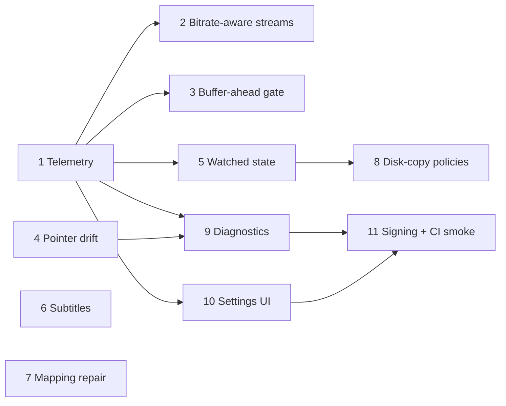

# Playback, pointer, library and operations expansion

Date: 2026-09-12
Status: Phases 1–2 implemented (see
[changelog](../changelog/playback-telemetry-and-line-fit.md)); Phase 3 waits
on the Phase 1 exit criterion. Implement one phase at a time, in order, and
stop for review between phases.

## Goal and scope

Expand HoshiStream along four axes without changing what it is: a private,
local-first, direct-play add-on with manually added media.

1. **Playback reliability** — attack TV (Nuvio/Stremio over LAN) stalls with
   TorrServer capabilities the add-on does not use yet.
2. **Pointer robustness** — make a stale or drifting remote pointer visible and
   one click away from fixed, still with strictly manual pushes (ADR 0012).
3. **Library and content** — watched state, subtitles, mapping repair, and
   disk-copy policies on top of the existing archiver.
4. **Operations and trust** — supportable diagnostics, a small settings UI,
   signing, and cross-platform smoke coverage.

Out of scope, and requiring a new ADR before any work: torrent search or
scraping, generic Torznab, transcoding expansion, a database, a dashboard
beyond the existing management UI, containers, or public exposure of
TorrServer's admin port. Runtime dependencies stay `stremio-addon-sdk`, `zod`,
`bencode` (+`uint8-util`) unless approved.

## Verified TorrServer facts this plan relies on

Checked against the pinned MatriX.141 source (`d266990…`) and the live Swagger
on 2026-09-12. Anything not listed here must be re-verified before use.

- `GET /stream?link=…&index=…&preload[&stat|&play]` runs `torr.Preload`
  **synchronously in the request handler** before answering. Preload size is
  `PreloadCache% × CacheSize` (shipped: 40 % × 4 GiB ≈ 1.6 GiB, ~25 min on a
  9 Mbps line). Preload reads a start range of `size − startend` and a tail
  range (for `moov` atoms), sets `Stat = TorrentPreload`, and aborts after
  `TorrentDisconnectTimeout` capped at 60 s. `preload_size`/`preloaded_bytes`
  are exposed in `TorrentStatus`. **Consequence:** the global preload is not a
  usable gate; the add-on must size and time its own.
- `POST /cache {action:"get", hash}` → `state.CacheState` (source:
  `server/torr/storage/state/state.go`): `Hash`, `Capacity`, `Filled`,
  `PiecesLength`, `PiecesCount`, `Torrent` (`TorrentStatus`),
  `Pieces` (map piece-index → `{Id, Length, Size, Completed, Priority}`),
  `Readers[]` → `{Start, End, Reader}` where `Start`/`End` are **piece
  indexes** of the reader window and `Reader` is the current piece. Field
  names are Go-cased (no JSON tags), so the Zod schema must accept
  `Capacity`, not `capacity`; confirm against a live response first.
- `POST /torrents {action:"get", hash}` → `TorrentStatus` includes
  `download_speed`, `upload_speed`, `active_peers`, `connected_seeders`,
  `bit_rate`, `duration_seconds`, `preloaded_bytes`, `file_stats`.
- `POST /settings {action:"set", sets}` calls `SetSettings`, which **drops all
  torrents, disconnects and reconnects the BitTorrent client**. It is a
  restart-equivalent, not a live tweak; only safe when no stream is active.
  With `StoreSettingsInJson: true` it rewrites `settings.json`.
- `POST /viewed {action:"set"|"rem"|"list", hash, file_index}` persists
  watched file indexes per hash (`StoreViewedInJson: false` in shipped
  settings → stored in `config.db`).
- `GET /play/{hash}/{id}` streams with `Range` support and does not preload.
- `GET /ffp/{hash}/{id}` runs ffprobe inside TorrServer; the add-on already has
  its own bundled ffprobe, so this stays unused.

## Baseline

- Streams are handed to the player as a direct TorrServer URL, except disk-copy
  entries, which go through `/media/<token>/<entry>/<key>` (`media-source.ts`
  proxies torrent ranges when the drive is absent). Only the `/media` path
  gives the add-on a hook on the request itself.
- `warmStreamSource` (`inspection.ts`) registers the torrent when metadata is
  opened; there is no gate on how much is cached before play.
- `speedtest.ts` holds a measured or configured line speed (`homeSpeedMbps`);
  `streams.ts` already uses per-file `bitrateMbps` for the repair tier.
- The archiver yields to playback via `recentStreamActivity`.
- `PointerClient.remoteStatus()` exists and is served at
  `/api/system/pointer/remote`; it is not called automatically anywhere.
- TorrServer settings are seeded once from `packaging/torrserver-settings.json`
  and never rewritten by the launcher (except `TorrentsSavePath`).

## Phase 1 — Playback telemetry (observe before gating)

Goal: know, per active stream, whether the swarm is keeping ahead of the
playhead. No behavior change for the player.

1. `torrserver-client.ts`: add `cacheState(hash)` (`POST /cache`) with a Zod
   schema for the fields used (`Capacity`, `Filled`, `PiecesLength`,
   `Readers[].{Start, End, Reader}` as piece indexes; multiply by
   `PiecesLength` for byte offsets) and reuse `torrentStatus(hash)` for
   `download_speed`/`active_peers`.
2. New `playback-telemetry.ts`: while `recentStreamActivity` is fresh for an
   entry, sample every 2 s: completed pieces between each reader's `Reader`
   and `End` (bytes ahead of the playhead), swarm download speed, file bitrate
   (from `directPlay.bitrateMbps` or `bit_rate`), and derive
   `runwaySeconds = aheadBytes / (bitrate/8)` and
   `sustainable = downloadMbps >= bitrateMbps × 1.2`. Keep a 60-sample ring
   buffer per entry in memory only.
3. `routes/system-api.ts`: expose `GET /api/system/playback` (token-guarded,
   `no-store`) returning the current samples. Add `playback_sample` structured
   log at `warn` level only when runway drops below 10 s (rate-limited to once
   per 30 s per entry).
4. Management UI → Activity: a compact "runway" row per active stream (seconds
   ahead, swarm Mbps vs. bitrate Mbps, peers). Follow the instrument-panel
   conventions (0.14.0): hairline rows, status dots, no new cards.
5. Tests: `playback-telemetry.test.ts` (runway math, ring buffer bounds,
   rate-limited warning), client schema tests with a recorded `/cache` fixture.

Exit: while a TV stream stalls, the Activity page shows runway hitting zero
and swarm speed below bitrate — or shows the opposite, which redirects Phase 2.

## Phase 2 — Bitrate-aware stream presentation

Goal: stop stalls before they start by telling the client which files fit the
line. Uses only data the add-on already has plus Phase 1's speed.

1. `streams.ts`: compute `fit = bitrateMbps ≤ homeSpeedMbps × 0.8` per file.
   Order streams: fitting files first (existing order within), then others.
   Append `• needs N Mbps, line ~M Mbps` to the description of non-fitting
   files. Never hide a file.
2. Management UI stream/inspection view: same verdict inline, reusing the
   existing `?probe=true` speed verdict where present so the two never
   disagree.
3. `speedtest.ts`: record the last three measurements and use the median, so
   one bad startup test does not demote every file for the day.
4. Tests: ordering, description text, median selection, no change when speed
   is unknown.

Exit: a 12 Mbps file on a 9 Mbps line is listed after fitting alternatives
with an explicit reason; a 4 Mbps file is unaffected.

## Phase 3 — Add-on-sized buffer-ahead gate (conditional on Phase 1 evidence)

Goal: give the player a real runway at start without TorrServer's 1.6 GiB
preload. Only proceed if Phase 1 shows stalls correlate with a near-empty
cache at start rather than sustained under-speed (which no gate can fix).

1. Gate design (add-on side, no `/stream?preload`): on `stream_generated` for
   a torrent entry, `warmStreamSource` already registers the source. Extend it
   to open **one** bounded `Range: bytes=0-<N>` request against `/play` and
   discard the body, where `N = min(bitrate × targetSeconds / 8, 64 MiB)` and
   `targetSeconds` defaults to 20. This makes TorrServer schedule pieces for
   the file head using its own priority logic; the add-on never buffers
   content itself. Cancel the warm read when the player's first request
   arrives (detected via Phase 1 readers) or after 30 s.
2. Also warm the tail: a second `Range: bytes=<len-2MiB>-` request so MP4/MKV
   index atoms are cached before the player seeks for them. Skip when the
   probe already says the file is fast-start.
3. Disk-copy entries served through `/media`: optionally hold the first
   response until `runwaySeconds ≥ targetSeconds` or 8 s elapsed, whichever
   first. Direct TorrServer URLs cannot be held; document that.
4. Settings: `PLAYBACK_WARM_SECONDS` (default 20, `0` disables) via the Zod env
   schema and `.env.example`.
5. Tests: warm request sizing, cancellation, tail range, the `/media` hold
   timeout, and that no bytes are retained in add-on memory beyond the
   discarded stream chunks.

Exit: on a fresh torrent, time-to-first-frame on the TV is not worse than
before and the first 20 s play without a stall on a swarm that can sustain the
bitrate. Record measurements in the changelog.

## Phase 4 — Pointer drift detection and one-click push

Goal: a stale remote record is never silent again. Pushes stay manual.

1. `pointer.ts`: on add-on start and whenever the LAN address changes, call
   `remoteStatus()` once (best-effort, 5 s timeout) and store the observation
   (`match`, `remote-mismatch`, `remote-without-local-push`, `unreachable`) in
   memory with a timestamp. Never retry in a loop; never push automatically.
2. `routes/system-api.ts` / status payload: include the observation so the
   dashboard Pointer card shows "Remote points at 192.168.1.2; this Mac is
   192.168.1.4" with an **Update now** button (existing push endpoint).
3. Menu bar (macOS supervisor, Windows tray): when the observation is
   `remote-mismatch`, show a one-line notification with a single "Update
   Remote Pointer" action that opens the existing push flow. Follow the
   existing native-notification pattern; no background polling.
4. Docs: update `pointer-server-vercel.md` "When your IP changes" and the
   troubleshooting entry added on 2026-09-12.
5. Tests: observation state machine, no automatic push under any state,
   notification triggered once per address change.

Exit: with the remote record deliberately stale, the dashboard and menu bar
flag it within one launch, and one click fixes it.

## Phase 5 — Watched state and Continue Watching

Goal: resume where you left off across Nuvio and the browser player using
TorrServer's `/viewed` plus add-on-side progress.

1. `torrserver-client.ts`: `setViewed(hash, fileIndex)`, `listViewed()`.
2. Progress: the add-on cannot see player position for direct URLs; record
   "started" on `stream_generated` and "watched" when TorrServer reports
   `bytes_read_useful_data ≥ 90 %` of the file during Phase 1 sampling, or
   when the browser player fires `ended`/≥ 90 % (`playback.ts`). Persist
   `{entryId, fileId, state, at}` in `library.json` next to `lastStreamedAt`
   (schema bump with migration test; no database).
3. Stremio: add a `Continue Watching` catalog (entries with a started, not
   watched, episode) and mark watched episodes in `meta` videos with the
   `watched`-style ordering Stremio supports (verify against the SDK version
   in use; do not invent fields).
4. UI: watched dot on episodes; "Mark watched / unwatched" actions; call
   `/viewed set|rem` to keep TorrServer's own web UI consistent.
5. Tests: state transitions, migration, catalog composition.

Exit: an episode played to the end on the TV shows as watched in the browser
and the next episode appears in Continue Watching.

## Phase 6 — Subtitles

Goal: serve subtitle sidecars that already exist in the torrent or on disk.

1. Detect `.srt`, `.vtt`, `.ass`, `.ssa` files in `file_stats` and in disk-copy
   folders; match to video files by basename and common language suffixes
   (`.en`, `.eng`, `.ru`, …).
2. Stremio `subtitles` resource: return `{ id, url, lang }` entries pointing at
   the add-on (`/subtitles/<token>/<entry>/<key>`), which fetches the sidecar
   from `/play` (small, whole-file) or disk, converts `.srt` → `.vtt` on the
   fly (pure string transform, no dependency), and caches the result in
   memory with a 1 h TTL.
3. Browser player: `<track>` elements from the same endpoint.
4. Tests: matching rules, `.srt`→`.vtt` conversion incl. malformed timestamps,
   containment checks for disk paths.

Exit: a torrent with `Movie.en.srt` shows an English subtitle option in Nuvio
and the browser player.

## Phase 7 — Episode mapping repair

Goal: fix mis-numbered or mis-ordered episodes without re-importing.

1. Management UI, series detail: "Fix mapping" opens the existing
   collision-review table with editable season/episode per file, a "shift
   all by N" helper, and duplicate/gap highlighting.
2. Persist as an explicit override on the entry (`episodeOverrides`), applied
   after automatic mapping so re-inspection never silently undoes it.
3. Tests: override precedence, shift helper, validation (no two files on one
   S/E).

Exit: a series imported with off-by-one numbering is corrected in place and
Stremio shows the corrected order without re-adding.

## Phase 8 — Disk-copy policies

Goal: let the archiver work ahead and clean up behind the viewer.

1. Per-series policy on the entry: `keepAhead: N` (archive the next N
   unwatched episodes after the one just played) and `evictWatched: boolean`
   (drop disk copies of watched episodes once `keepAhead` is satisfied).
2. Archiver: consume Phase 5 watched state; keep the existing yield-to-
   playback and resumable behaviour; evictions are logged and reversible via
   the manifest until the next run.
3. UI: policy controls on the Storage page per series; global default off.
4. Tests: selection under both policies, no eviction of the currently playing
   file, drive-absent behaviour.

Exit: after watching S01E03 with `keepAhead: 2`, E04–E05 archive and E01–E02
are evicted (if enabled) without touching E03.

## Phase 9 — Diagnostics bundle

Goal: support without leaking secrets.

1. `GET /api/system/diagnostics` (token-guarded) assembles: redacted
   `server.log` tail (reuse `redactTorrServerLine` and the addon logger's
   redaction), effective TorrServer settings (from `/settings get`), the last
   speed tests, Phase 1 telemetry summary, pointer observation, app/bundle
   identity, OS version — as a single JSON. Tokens, secrets, magnet URIs and
   full paths under the home directory are redacted; a unit test asserts the
   redaction against fixtures containing each.
2. UI: "Copy diagnostics" on the System → Status page; menu bar "Reveal logs"
   stays.
3. Docs: `troubleshooting.md` "Ask for help" section referencing it.

Exit: the bundle from a running install contains no `ACCESS_TOKEN`,
`POINTER_PUSH_SECRET`, `Authorization` value, or `magnet:` string.

## Phase 10 — TorrServer settings UI

Goal: adjust the six settings that matter without editing JSON, and make the
seed-once behaviour explicit.

1. Expose `UploadRateLimit`, `DownloadRateLimit`, `ConnectionsLimit`,
   `CacheSize`, `ReaderReadAHead`, `TorrentDisconnectTimeout` on System →
   Status with the current values read from `/settings get`.
2. Apply path: refuse while any stream is active (Phase 1 activity), then
   `POST /settings set` with the full current object plus edits (the handler
   replaces the whole struct), and write the same keys into `settings.json`
   so a restart agrees. Show the "TorrServer reconnects; active torrents are
   dropped" consequence in the confirm step.
3. "Reset to shipped defaults" reads `packaging/torrserver-settings.json` from
   the bundle.
4. Optional adaptive default: on first run after a speed test, if
   `UploadRateLimit` is still the shipped value, offer (not apply) a cap of
   ~10 % of measured download speed.
5. Tests: refusal while streaming, full-object write, JSON/live agreement,
   reset.

Exit: changing `UploadRateLimit` in the UI is reflected by `/settings get` and
in `settings.json` after restart.

## Phase 11 — Signing and cross-platform smoke

Goal: remove install friction and catch platform drift.

1. macOS: Developer ID signing and notarization in
   `packaging/build-macos-app.sh`/`build-macos-dmg.sh` behind env-provided
   identity (never committed); document the Gatekeeper flow change in
   `distributing-macos-app.md`.
2. CI: run `scripts/smoke-native.mjs` on macOS and the Windows installer smoke
   on Windows runners against vendored runtimes; fail on divergence in the
   shared contract (`packaging/macos-contract.mjs` and the Windows
   equivalent).
3. Windows parity checklist for Phases 4, 9, 10 (tray notification, bundle
   paths, settings write).

Exit: a signed DMG opens without the "damaged" dialog on a clean Mac; CI
smoke passes on both platforms.

## Ordering and dependencies

Phases 4, 6 and 7 are independent and can be scheduled whenever convenient.
Phase 3 is explicitly conditional on Phase 1's evidence.

## Cross-cutting rules

- Every TorrServer call goes through `torrserver-client.ts` with a Zod schema
  and is listed in `api/torrserver-endpoints-used.md` with a source link at
  the pinned commit before it ships.
- Logs stay structured JSON; never tokens, auth headers, or magnet URIs.
- Each phase ends with `npm run typecheck && npm test && npm run lint &&
npm run format:check` in `addon/`, a changelog entry, and index updates.
  New decisions (Phase 3 gate semantics, Phase 5 persistence, Phase 11
  signing) get ADRs.
- No phase adds a runtime dependency without asking first.

## Open questions to settle before the relevant phase

- Phase 1: JSON casing of `CacheState` fields in a live `/cache` response
  (Go struct has no JSON tags).
- Phase 3: whether Nuvio issues its own head/tail probing requests that would
  make the tail warm redundant — observe in Phase 1 first.
- Phase 5: which watched/`videos` fields the installed `stremio-addon-sdk`
  version supports.
- Phase 11: availability of a Developer ID; without it, Phase 11 reduces to
  CI smoke only.

## References

- [2026-09-12 stale pointer reads and slow-link tuning](2026-09-12-stale-pointer-reads-and-slow-link-tuning.md)
- [ADR 0024 — immutable pointer Blob versions](../decisions/0024-immutable-pointer-blob-versions.md)
- [ADR 0012 — Vercel pointer server, manual pushes](../decisions/0012-vercel-pointer-server.md)
- [ADR 0020 — manual import via the Chrome companion, discovery retired](../decisions/0020-manual-import-chrome-companion.md)
- [api/torrserver-endpoints-used.md](../api/torrserver-endpoints-used.md)
- [changelog/0.6.0-performance.md](../changelog/0.6.0-performance.md) — prior tuning and the deferred preload note
