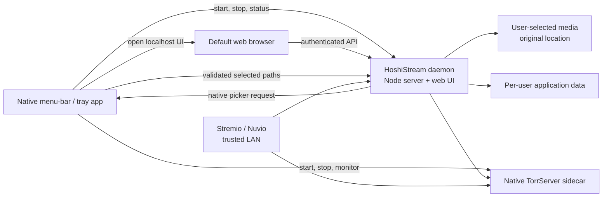
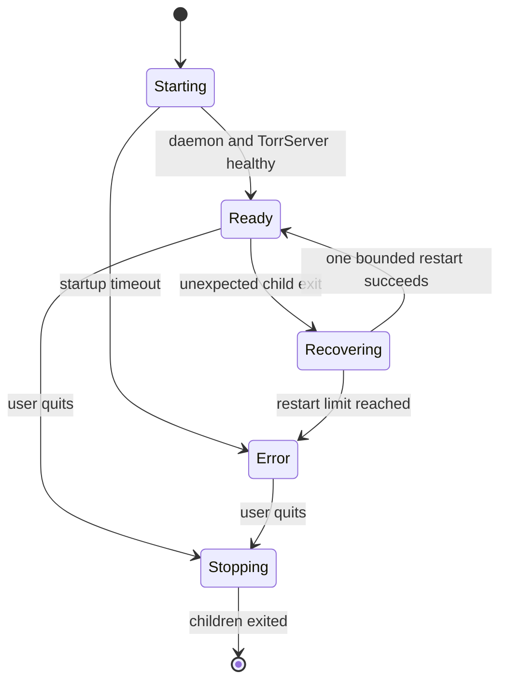

# HoshiStream Installed-App Strategy

## Direction

Build HoshiStream like Syncthing:

- an installed application starts and supervises the server;
- the server runs in the background;
- the user manages the library through a local web interface;
- Stremio and Nuvio connect over the trusted LAN;
- a small platform-native menu-bar or tray application provides lifecycle,
  status, native file dialogs, and start-at-login controls.

Electron is no longer part of the plan. The existing web interface remains the
primary UI.

Ship in this order:

1. macOS Apple Silicon
2. macOS Intel
3. Windows x64
4. Linux x64
5. Other architectures only after their TorrServer binaries are verified

The application remains private, local-first, direct-play only, and intended
for legally owned or authorized media. Torrent search, transcoding, cloud
accounts, a database, and a public service remain out of scope.

## Product contract

The installed app must:

- require no Docker and no separately installed Node.js;
- start HoshiStream and TorrServer together;
- keep them running while the menu-bar/tray app is active;
- stop them cleanly through a Quit action;
- optionally start at login;
- open the management UI in the default browser;
- expose health, LAN address, ports, and the Stremio manifest URL;
- manage torrent links, local files, and series folders;
- use native file/folder dialogs without copying original media;
- preserve inspection, bitrate guidance, metadata editing, and posters;
- serve seekable local video with HTTP range support;
- persist library and settings safely across upgrades;
- show actionable port, firewall, path, and startup errors.

The first release does not need automatic updates, Mac App Store distribution,
a Windows service, a Linux system daemon, remote administration, or a new UI.

## Architecture



## Components

### HoshiStream daemon

The daemon is the current Node/TypeScript application, extracted from Docker
and packaged with its runtime.

Responsibilities:

- serve the management interface;
- serve the Stremio add-on protocol;
- manage the atomic JSON library;
- stream local media with HTTP range support;
- inspect media with `ffprobe`;
- communicate with TorrServer;
- validate local paths;
- authenticate management and add-on requests;
- expose `/health`, `/ready`, and a small supervisor-status endpoint;
- accept native picker results only from the local supervisor channel.

The daemon must expose:

```ts
startHoshiStream(config): Promise<{
  close(): Promise<void>;
  addonUrl: string;
  managementUrl: string;
}>;
```

`addon/src/index.ts` should become a thin command-line entry point. Catalog,
metadata, stream, library, inspection, and route modules should remain shared
and unchanged unless native paths require it.

### TorrServer sidecar

Bundle the pinned native TorrServer executable for each target:

- `TorrServer-darwin-arm64`
- `TorrServer-darwin-amd64`
- `TorrServer-windows-amd64.exe`
- `TorrServer-linux-amd64`

The supervisor starts TorrServer with explicit configuration, torrent, cache,
and log directories. It monitors the child process, restarts only after a
bounded failure, and stops it during application shutdown.

Every release job downloads the pinned asset and verifies its recorded SHA-256.
Do not silently upgrade TorrServer.

### Native supervisor

The supervisor is deliberately small. It does not render the management UI.

macOS responsibilities:

- run as a menu-bar application;
- start and monitor the daemon and TorrServer;
- show Ready, Starting, or Error status;
- open the web interface;
- copy the Stremio manifest URL;
- open Finder file/folder dialogs;
- provide Start at Login;
- reveal logs and application-data folders;
- quit both services cleanly.

The first macOS supervisor should be written in Swift using AppKit and
`NSStatusItem`. This gives native Finder dialogs and lifecycle behavior without
bundling Chromium.

Windows and Linux supervisors are later platform shells around the same daemon
contract. They do not fork the core application.

### Browser management interface

Keep the current responsive management interface as the only library UI.

The browser UI:

- opens at a loopback management URL;
- uses the existing bearer-authenticated API;
- displays daemon, TorrServer, LAN, and Stremio status;
- asks the daemon for a native picker when the supervisor is available;
- falls back to server-side approved-folder browsing when it is not;
- never receives unrestricted filesystem access.

The management interface should bind to loopback by default. Stremio protocol
and playback routes may bind to the trusted LAN. If keeping one HTTP listener,
retain token protection and make the security boundary explicit.

## Native picker design

A browser cannot return arbitrary native filesystem paths. The installed app
therefore needs a small authenticated local control channel.

Recommended macOS flow:

1. The browser calls `POST /api/native-picker/file` or
   `POST /api/native-picker/folder`.
2. The daemon sends a request over a loopback-only Unix-domain socket to the
   supervisor.
3. The Swift supervisor displays `NSOpenPanel`.
4. The supervisor returns the selected canonical path.
5. The daemon validates that the path exists and is a supported file or folder.
6. The library stores that absolute path.

Controls:

- socket permissions must allow only the current user;
- every request receives a short-lived nonce;
- paths are never accepted directly from browser request bodies;
- cancel returns no path and makes no library change;
- deleting a library entry never deletes the original selected media.

Windows later uses a named pipe. Linux uses a Unix-domain socket.

## Process and network model

The supervisor owns both child processes:



Rules:

- choose ports before starting either service;
- persist selected ports;
- detect collisions and show the owning failure;
- advertise the active LAN IP, not `127.0.0.1`, to Stremio clients;
- update advertised URLs after network changes;
- do not log the access token or tokenized URL;
- use SIGTERM and a bounded wait before force termination;
- clean up stale PID/socket files only after confirming no live owner;
- do not restart indefinitely.

Initial defaults remain:

- HoshiStream: port 7001
- TorrServer: port 8090

## State layout

Use the platform per-user application-data directory.

macOS:

```text
~/Library/Application Support/HoshiStream/
├── library.json
├── settings.json
├── access-token
├── run/
│   ├── supervisor.sock
│   └── service-state.json
├── logs/
│   ├── hoshistream.log
│   └── torrserver.log
├── torrserver/
│   ├── config/
│   ├── torrents/
│   └── cache/
└── backups/
```

Windows later uses `%APPDATA%\\HoshiStream`. Linux uses the appropriate XDG
directories.

Never write mutable state inside the installed application bundle. Keep atomic
JSON writes; a database is unnecessary at the expected library size.

## Repository shape

```text
addon/src/                     reusable daemon modules
supervisor/
├── protocol.md                control-channel contract
├── macos/
│   ├── HoshiStream.xcodeproj
│   └── Sources/
├── windows/                   added during Windows phase
└── linux/                     added during Linux phase
packaging/
├── torrserver-lock.json       version, asset names, SHA-256
├── fetch-torrserver.mjs
└── macos/
docs/                          historical location; now hoshistream_docs/plans/
└── desktop-app-strategy.md
```

Do not create Windows or Linux supervisor scaffolding during the macOS phase.
The shared contract belongs in `supervisor/protocol.md`; platform code arrives
only when its phase begins.

## Delivery plan

### Phase 0 — Lock contracts

Deliverables:

- daemon start/stop API;
- supervisor control-channel protocol;
- state and migration schema;
- port and LAN-advertisement behavior;
- child-process lifecycle rules;
- pinned TorrServer assets and checksums;
- first target fixed to macOS ARM64 outside the Mac App Store.

Exit criteria:

- no unresolved decision affects state format, process ownership, or picker
  security.

### Phase 1 — Native daemon proof on macOS

Work:

- download and verify `TorrServer-darwin-arm64`;
- run TorrServer without Docker;
- refactor `addon/src/index.ts` behind `startHoshiStream()` and `close()`;
- add a development launcher that owns both processes;
- move runtime state into a temporary macOS application-data directory;
- detect the LAN IP and expose the correct manifest URL;
- implement graceful shutdown.

Verification:

- stop the Docker stack;
- play the legal Sintel torrent through Stremio;
- play and seek one local H.264/AAC file from the TV;
- inspect bitrate and codec details;
- quit and prove no child process remains.

Exit criteria:

- the complete server works natively without Docker or Electron.

### Phase 2 — macOS menu-bar supervisor

Work:

- create the Swift menu-bar application;
- bundle the daemon runtime and TorrServer binary;
- implement Start, Open HoshiStream, Copy Stremio URL, Show Logs, and Quit;
- show live service health;
- implement single-instance behavior;
- implement bounded child restart;
- add Start at Login as an explicit user option.

Exit criteria:

- opening the app starts both services;
- the browser management UI opens successfully;
- Quit reliably stops both services;
- failures appear in the menu and logs.

### Phase 3 — Native Finder integration

Work:

- implement the Unix-domain control socket;
- define nonce-based picker requests;
- implement `NSOpenPanel` for files and folders;
- replace browser uploads with native zero-copy paths when installed;
- retain browser upload only as an explicit fallback;
- validate path existence, type, supported extension, and symlink resolution;
- add Relink for moved or renamed media.

Exit criteria:

- Finder-selected files and series folders play from their original locations;
- browser requests cannot inject arbitrary paths;
- deleting entries never deletes source files.

### Phase 4 — Docker-library migration

Work:

- detect an existing HoshiStream project only when the user chooses Import;
- back up the desktop library before mutation;
- import `data/library.json`;
- rewrite `/media/...` using the old `MEDIA_DIR`;
- rewrite managed copies from `/data/media/...` only after user confirmation;
- copy settings but not torrent cache;
- report entries that need relinking.

Exit criteria:

- existing torrent and local entries survive migration;
- the Docker project remains untouched and recoverable;
- migration can be rerun safely without duplicates.

### Phase 5 — macOS packaging and release

Work:

- produce separate ARM64 and Intel builds;
- place daemon and TorrServer resources outside sealed archives as required;
- add icons and version metadata;
- sign the supervisor, daemon runtime, helpers, and TorrServer executable;
- enable hardened runtime;
- notarize and staple the application;
- package a DMG;
- test Gatekeeper and firewall behavior on a clean user account.

Exit criteria:

- the DMG installs into `/Applications`;
- the app opens without bypass instructions;
- no Node, Docker, or TorrServer prerequisite exists;
- upgrade preserves library and settings;
- TV playback works with the macOS firewall enabled.

Apple distribution requires an Apple Developer account, Xcode, signing
certificates, and notarization credentials. Before those are available, builds
must be labeled local-development only.

### Phase 6 — macOS beta hardening

Test:

- Apple Silicon and Intel;
- Stremio desktop and TV;
- Nuvio;
- movies, single episodes, and series folders;
- H.264/AAC MP4 and MKV;
- HEVC where the playback client supports it;
- port collision;
- Wi-Fi changes;
- sleep/wake;
- missing or moved files;
- daemon and TorrServer crashes;
- launch at login;
- application upgrade;
- one-hour playback with repeated seeking.

Exit criteria:

- no known data-loss, token-exposure, or orphan-process defects;
- predictable failures have visible recovery actions.

### Phase 7 — Windows x64

Reuse the daemon, web UI, library schema, and supervisor protocol.

Platform work:

- bundle `TorrServer-windows-amd64.exe`;
- add a small Windows tray supervisor;
- replace Unix sockets with a current-user named pipe;
- use native Windows file/folder dialogs;
- translate process termination and path handling;
- store state under `%APPDATA%`;
- show Windows Defender Firewall guidance;
- build and sign an installer;
- verify upgrade and uninstall behavior.

Do not add a Windows service initially. The daemon runs while the tray
application is running.

Exit criteria:

- clean installation with no Docker or Node prerequisite;
- torrent and local playback from another LAN device;
- clean shutdown and signed installer.

### Phase 8 — Linux x64

Reuse the daemon, web UI, library schema, and Unix-socket protocol.

Platform work:

- bundle `TorrServer-linux-amd64`;
- add a small tray supervisor for the chosen reference desktop;
- use XDG paths;
- integrate a native file/folder dialog;
- produce one primary package format first;
- document firewall setup for the supported distribution;
- test Wayland and X11 behavior.

Do not create a systemd service for the first release. Add one only if users
need headless or boot-time operation without a desktop session.

Exit criteria:

- supported package installs on the reference distribution;
- no separately installed runtime is required;
- LAN playback and process shutdown pass.

## Release pipeline

Use a native build job for each target:

- macOS ARM64 builds, signs, and notarizes ARM64;
- macOS x64 builds, signs, and notarizes x64;
- Windows x64 builds and signs Windows;
- Linux x64 builds Linux.

Every job:

1. downloads the pinned TorrServer asset;
2. verifies SHA-256;
3. runs typecheck, tests, and protocol checks;
4. builds the daemon bundle;
5. builds the platform supervisor;
6. packages the installer;
7. launches a smoke test;
8. verifies health, manifest, HEAD, range, inspection, and shutdown;
9. publishes artifact checksums.

Do not cross-build a release that cannot be launched and smoke-tested on its
target operating system.

## Security decisions

- Generate a long random access token on first launch.
- Keep the management UI loopback-only where practical.
- Expose only Stremio and playback routes to the trusted LAN.
- Never enable router forwarding, UPnP, or a public tunnel automatically.
- Keep TorrServer upload and UPnP disabled.
- Keep torrent search disabled.
- Verify every bundled TorrServer binary.
- Restrict picker IPC to the current user.
- Accept native paths only from the authenticated supervisor channel.
- Never log tokens, authorization headers, or complete magnet URIs.
- Clearly disclose that P2P reveals the user's IP to peers.

## Main risks

| Risk | Mitigation |
|---|---|
| Browser cannot access native paths | Authenticated supervisor picker channel |
| Daemon or TorrServer remains running | Supervisor ownership, bounded shutdown, startup cleanup |
| macOS rejects nested binaries | Sign every executable before signing/notarizing the outer app |
| TV cannot reach the server | Advertised-LAN health check and firewall guidance |
| Wi-Fi address changes | Detect network changes and refresh advertised URLs |
| Port collision | Preflight ports and expose configurable fallback |
| Selected media moves | Validate on use and provide Relink |
| Browser submits arbitrary paths | Never trust browser path strings; accept supervisor results only |
| Library migration damages data | Atomic migration, backup, validation, idempotency |
| TorrServer version drifts | Pinned assets and SHA-256 lock file |
| Platform shells diverge | Stable supervisor protocol and shared daemon tests |

## Recommended first implementation slice

Implement only Phases 0 and 1:

1. define the daemon lifecycle API;
2. define the supervisor protocol;
3. pin and fetch `TorrServer-darwin-arm64`;
4. add the native macOS development launcher;
5. move state out of Docker paths;
6. prove Stremio torrent and local playback;
7. prove clean shutdown.

Do not create the Swift menu-bar application until the native two-process
daemon proof is stable.

## Completion definition

The installed-app project is complete when macOS, Windows, and Linux packages:

- require no Docker or separately installed runtime;
- run the server in the background under a small native supervisor;
- use the browser management interface;
- use native zero-copy file and folder selection;
- preserve one shared library and protocol implementation;
- start and stop reliably;
- stream local and authorized torrent media across a trusted LAN;
- preserve state safely across upgrades and expected failures.
